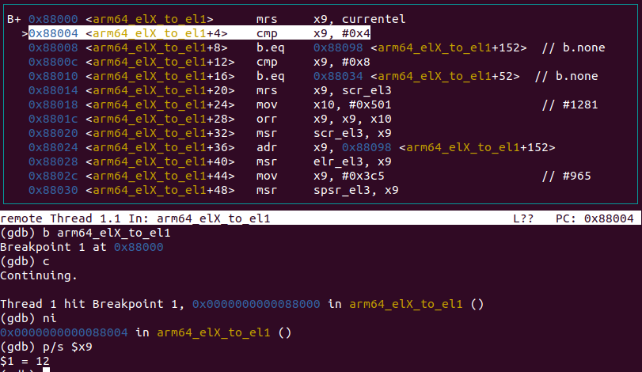
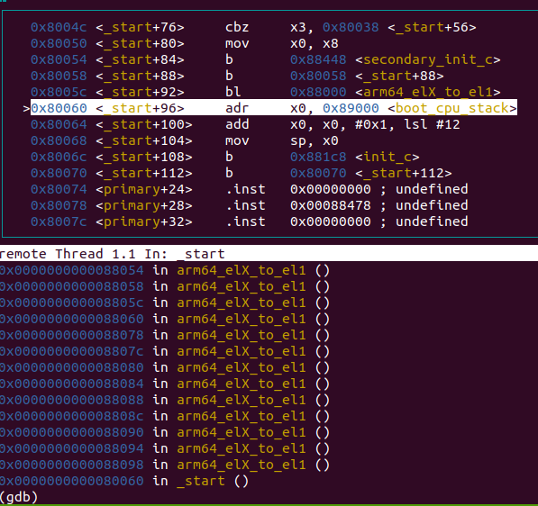
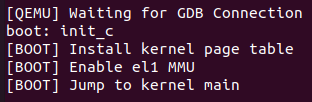
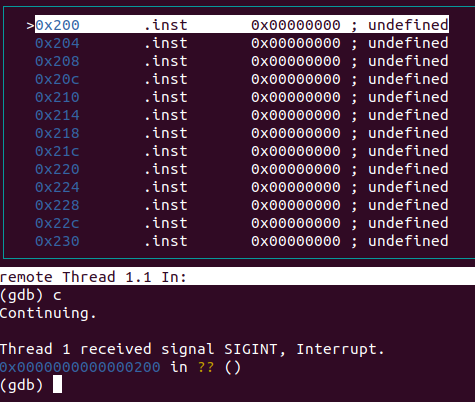
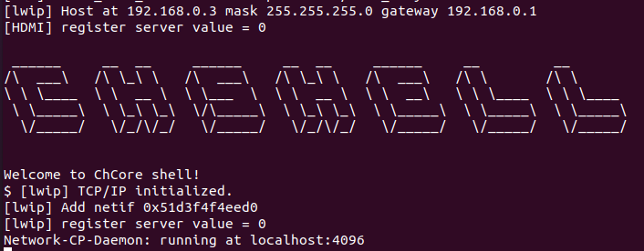
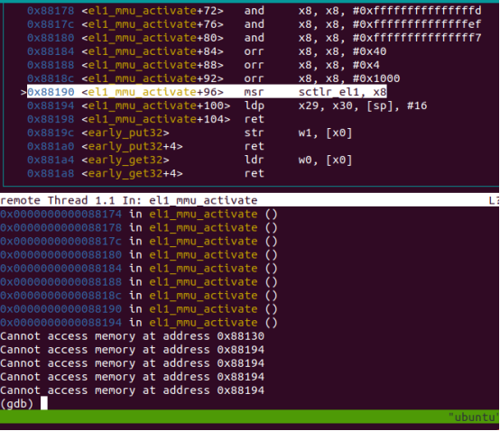
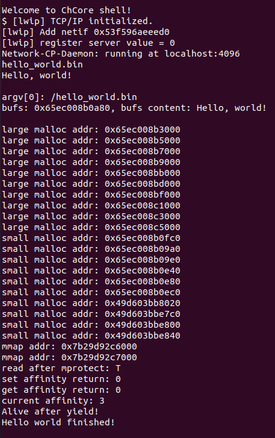
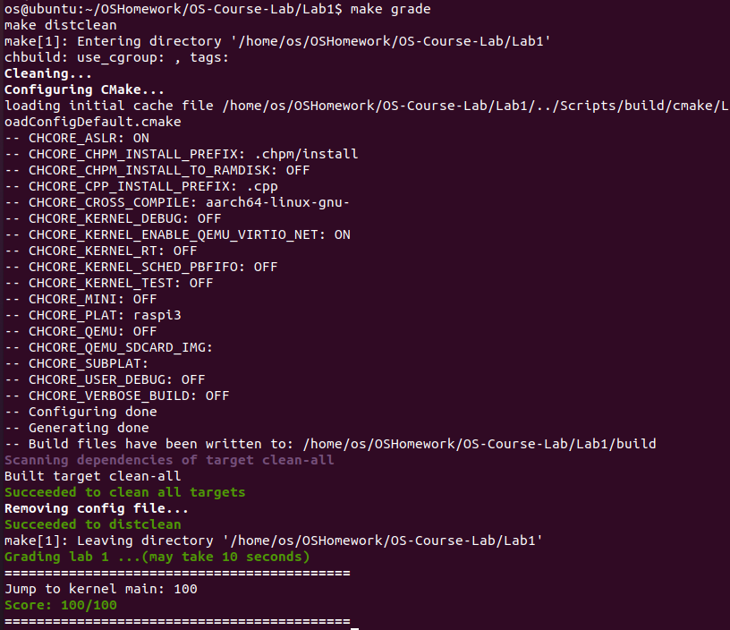

# 实验 1：机器启动报告

**邬天行 522030910206**

> 思考题 1：阅读 `_start` 函数的开头，尝试说明 ChCore 是如何让其中一个核首先进入初始化流程，并让其他核暂停执行的。

考虑`_start` 的前三行代码：

```assembly
mrs	x8, mpidr_el1
and	x8, x8,	#0xFF
cbz	x8, primary
```

`mpidr_el1` 寄存器的低 8 位表示多核处理器中的唯一ID，程序仅允许这个变量为 0 的CPU进入`primary` 函数率先初始化，剩余的CPU会被暂时挂起直到 `clear_bss_flag` 以及 `secondary_boot_flag` 两个变量均满足条件后继续执行。

> 练习题 2：在 `arm64_elX_to_el1` 函数的 `LAB 1 TODO 1` 处填写一行汇编代码，获取 CPU 当前异常级别。

考虑下文判断特权等级的代码：

```assembly
// Check the current exception level.
cmp x9, CURRENTEL_EL1
beq .Ltarget
cmp x9, CURRENTEL_EL2
beq .Lin_el2
// Otherwise, we are in EL3.
```

我们需要将 `CurrentEL` 寄存器的值存入 `x9` 寄存器中以判断特权等级，因此填写代码为：

```assembly
mrs x9, CurrentEL
```

验证：使用 GDB 调试，可以看到`x9`存储了异常等级。



> 练习题 3：在 `arm64_elX_to_el1` 函数的 `LAB 1 TODO 2` 处填写大约 4 行汇编代码，设置从 EL3 跳转到 EL1 所需的 `elr_el3` 和 `spsr_el3` 寄存器值。具体地，我们需要在跳转到 EL1 时暂时屏蔽所有中断、并使用内核栈（`sp_el1` 寄存器指定的栈指针）。

仿照下面 `.Lno_gic_sr` 函数中相同的代码即可。

该段代码首先以 `x9` 为中介将 `elr_el3` 寄存器的值设置为`.Ltarget`的地址，表示执行 `eret` 指令后跳转到 `.Ltarget` 处，然后设置 `spsr_el3` 寄存器的 `DAIF` 和 `EL1H` 字段，前者表示屏蔽所有中断，后者表示使用内核栈。

验证：使用 GDB 调试，可以看到成功返回到 `_start` 函数。



> 思考题 4：说明为什么要在进入 C 函数之前设置启动栈。如果不设置，会发生什么？

C函数运行时需要利用栈来行使保存局部变量、记录返回地址、传参等多种功能，没有栈的话无法正常进行函数调用。

> 思考题 5：在实验 1 中，其实不调用 `clear_bss` 也不影响内核的执行，请思考不清理 `.bss` 段在之后的何种情况下会导致内核无法工作。

bss段用于记录未初始化的全局变量和静态变量，不清空的话初始化时可能不为0值；而C 语言规定，未初始化的全局变量和静态变量会被清零。

因此，如果进入 `init_c` 函数之前`.bss` 段被修改为非零值，而后C 程序在未清理`.bss`段的情况下又使用了未初始化的全局变量或静态变量时，内核会无法正确工作。

> 练习题 6：在 `kernel/arch/aarch64/boot/raspi3/peripherals/uart.c` 中 `LAB 1 TODO 3` 处实现通过 UART 输出字符串的逻辑。

代码思路：顺序遍历字符串，调用 `early_uart_send` 函数输出每个字符即可。

```c
for (int i = 0; str[i] != '\0'; i++)
{
    early_uart_send(str[i]);
}
```

验证：直接运行代码后得到了输出的字符串。



> 练习题 7：在 `kernel/arch/aarch64/boot/raspi3/init/tools.S` 中 `LAB 1 TODO 4` 处填写一行汇编代码，以启用 MMU。

填写代码如下：

```assembly
orr x8, x8, #SCTLR_EL1_M
```

该行代码通过修改 `x8` 寄存器的值，设置 `sctlr_el1` 寄存器的 `M` 字段表示启用 MMU。

验证：在 GDB 中可以观察到内核在 `0x200` 处无限循环。



> 思考题 8：请思考多级页表相比单级页表带来的优势和劣势（如果有的话），并计算在 AArch64 页表中分别以 4KB 粒度和 2MB 粒度映射 0～4GB 地址范围所需的物理内存大小（或页表页数量）。

优势：多级页表允许页表中出现空洞，有效利用了虚拟地址空间的稀疏性，在绝大多数情况下可以大幅减少页表占用的空间。

劣势：多级页表增加了访存次数，提高了地址翻译的时间开销；在页表页占用非常多的极端情况下不如单级页表。

以  4KB  粒度映射  4GB  地址空间，需要  4GB/4KB=1M  个物理页，即L3 页表  1M/512=2K  个，L2 页表  2K/512=4  个，L1 和 L0 页表各  1  个，共计  2K+4+1+1=2054  个页表页，约占用物理内存  2K * 4KB = 8MB 。

以  2MB  粒度映射  4GB  地址空间，需要  4GB/2MB=2K  个大页，即 L2 页表  2K/512=4  个，L1 和 L0 页表各  1  个，共计  4+1+1=6  个页表页，占用物理内存  6 * 4KB=24KB 。

> 思考题 9： 计算在练习题 10 中，你需要映射几个 L2 页表条目，几个 L1 页表条目，几个 L0 页表条目。页表页需要占用多少物理内存？

以  2MB  粒度映射  1GB  地址空间，需要  1GB/2MB=512  个 L2 页表条目，即 L2 页表  512/512=1  个，L1 和 L0 页表条目/页表各  1  个，共计  1+1+1=3  个页表页，占用物理内存  3 * 4KB=12KB 。

> 练习题 10：请在 `init_kernel_pt` 函数的 `LAB 1 TODO 5` 处配置内核高地址页表（`boot_ttbr1_l0`、`boot_ttbr1_l1` 和 `boot_ttbr1_l2`），以 2MB 粒度映射。

代码思路：由于此处对高地址进行映射，虚拟地址需要在物理地址上增加 `KERNEL_VADDR` 的偏移量，然后仿照配置低地址字段的方式按照 `boot_ttbr1_l0`、`boot_ttbr1_l1` 和 `boot_ttbr1_l2` 的顺序配置页表即可。

至此，ChCore 内核已经可以正确完成启动流程。



> 思考题 11：请思考在 `init_kernel_pt` 函数中为什么还要为低地址配置页表，并尝试验证自己的解释。

启用MMU时的下一条指令仍然在低位运行，如果不配置的话则后续无法正确寻址。

验证：暂时删去 `init_kernel_pt` 函数中配置低地址页表的相关代码，然后使用 GDB 单步调试 `el1_mmu_activate` 函数，观察其执行过程。



可以看到，在 MMU 开启以后立即发生寻址错误。

> 思考题 12: 在一开始我们暂停了三个其他核心的执行，根据现有代码简要说明它们什么时候会恢复执行。思考为什么一开始只让 0 号核心执行初始化流程？

在`_start`函数中中可以得知，只要其他核心按顺序检查到：

1. `clear_bss_flag`：由`clear_bss`函数修改, 表明`.bss`段是否已经被清零;
2. `M[secondary_boot_flag + x8]`: 表示了在`secondary_boot_flag`数组中第`x8`个，也就是第处理器ID个。该数组被初始化为`{NOT_BSS, 0, 0, ...}`, 表明目前执行的不能是0号核；

两个变量均满足条件就会恢复执行次要核。

需要一个核心（主核心）首先执行初始化流程，以确保核共用的系统资源（如内存、外设等）被正确配置和初始化；如果所有核心同时开始执行初始化代码，可能会产生资源冲突；如果在初始化过程中出现错误，首先启动的主核心可以处理这些错误，而不必同时处理多个核心的错误。

> 验证机器启动是否成功：

1. 启动后执行`hello_world.bin`:



2. 运行`make grade`：(需要额外安装`psutils`)



由此可见机器已成功启动。
