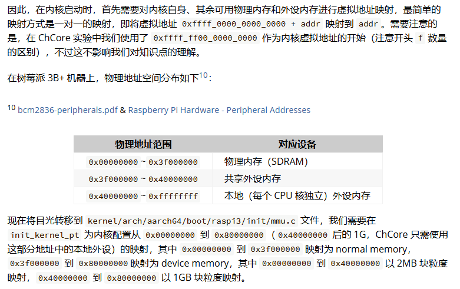

# 实验 2：内存管理

**邬天行 522030910206**

---

> 练习题 1：完成 `kernel/mm/buddy.c` 中的 `split_chunk`、`merge_chunk`、`buddy_get_pages`、 和 `buddy_free_pages` 函数中的 `LAB 2 TODO 1` 部分,其中 `buddy_get_pages` 用于分配指定阶大小的连续物理页,`buddy_free_pages` 用于释放已分配的连续物理页。

考虑 `buddy.h` 和 `list.h` 两个文件中关于buddy system相关的代码：
```c
struct page {
        /* Free list */
        // 该物理页在链表中的指代节点
        struct list_head node;
        /* Whether the correspond physical page is free now. */
        // 标记是否被分配。 0表示未分配,1表示已分配
        int allocated;
        /* The order of the memory chunck that this page belongs to. */
        // 该物理页的阶次,也即大小为 2^order * PAGE_SIZE
        int order;
        /* Used for ChCore slab allocator. */
        void *slab;
        /* The physical memory pool this page belongs to */
        struct phys_mem_pool *pool;
};

struct free_list {
        //链表的表头,链表内每一项均指向一个未被分配的物理页
        struct list_head free_list;
        //该链表的长度,也即可分配的物理页个数 
        unsigned long nr_free;
};

//一个双向链表结构,其中表头节点不行使功能
struct list_head {
    struct list_head *prev;
    struct list_head *next;
};

//链表相关的函数
static inline void init_list_head(struct list_head *list);
static inline void list_add(struct list_head *new, struct list_head *head);
static inline void list_append(struct list_head *new, struct list_head *head);
static inline void list_del(struct list_head *node);
static inline bool list_empty(struct list_head *head);

/*
list_entry(ptr,type,field)返回：
ptr作为[type结构体的field成员]的指针 对应的 type结构体指针
具体来说,ptr为指向结构体某个成员的指针, type为该结构体类型, field为这个成员
原理为利用结构体分配内存连续性, container_of宏先通过((type *)(0))->field获得field的内存offset, 再将与field对应的ptr减去这个offset从而获得type本身的指针
*/
#define list_entry(ptr, type, field) \
    container_of(ptr, type, field)

#define container_of(ptr, type, field) \
    ((type *)((void *)(ptr) - (void *)(&(((type *)(0))->field))))
```

**涉及页面分裂和合并的函数维护`free_lists`链表均注意需要同时维护链表本体和长度, 且需要维护`allocated`和`order`成员**

对于 `spilt_chunk` 函数：采用递归方式实现

递归终止条件：当前页面的阶次已经是我们需要的阶次

对于每一个chunk,获取比它阶次低一级的chunk的地址作为buddy_chunk送入free_lists,然后将分裂后的chunk继续递归

```c
__maybe_unused static struct page *split_chunk(struct phys_mem_pool *__maybe_unused pool,
                                int __maybe_unused order,
                                struct page *__maybe_unused chunk)
{
        /* LAB 2 TODO 1 BEGIN */
        /*
         * Hint: Recursively put the buddy of current chunk into
         * a suitable free list.
         */
        /* BLANK BEGIN */
        
        // end of recursion
        if (chunk->order == order) return chunk;

        chunk->order--;
        struct page *buddy_chunk = get_buddy_chunk(pool, chunk);
        buddy_chunk->order = chunk->order;
        buddy_chunk->allocated = 0;
        list_add(&(buddy_chunk->node), &(pool->free_lists[buddy_chunk->order].free_list));
        pool->free_lists[buddy_chunk->order].nr_free++;
        return split_chunk(pool, order, chunk);
        /* BLANK END */
        /* LAB 2 TODO 1 END */
}
```

对于 `merge_chunk` 函数：采用递归方式实现

递归终止条件：已经合并到最大阶次

注意到`get_buddy_chunk`函数仅能返回单一地址, 需要检查如下情况:
- 该页面是否存在
- 是否与原chunk具有相同的阶次
- 是否处于未分配状态

对于每一个chunk,将buddy_chunk从free_lists内移除,并取二者更低的地址作为高一阶次的chunk的地址继续递归合并,并维护相应信息

```c
__maybe_unused static struct page * merge_chunk(struct phys_mem_pool *__maybe_unused pool,
                                struct page *__maybe_unused chunk)
{
        /* LAB 2 TODO 1 BEGIN */
        /*
         * Hint: Recursively merge current chunk with its buddy
         * if possible.
         */
        /* BLANK BEGIN */

        // end of recursion
        if (chunk->order == (BUDDY_MAX_ORDER-1)) return chunk;
        
        //get buddy_chunk
        struct page *buddy_chunk = get_buddy_chunk(pool, chunk);
        
        
        //false conditions: 
        //1. no else buddy chunk
        if (!buddy_chunk) return chunk;
        //2. buddy chunk can't be allocated
        if (buddy_chunk->allocated == 1) return chunk;
        //3. buddy chunk is not free as a whole
        if (buddy_chunk->order != chunk->order) return chunk;

        list_del(&(buddy_chunk->node));
        pool->free_lists[buddy_chunk->order].nr_free--;

        buddy_chunk->order++;
        chunk->order++;        
        
        //let chunk be the addr of smaller one
        if (chunk > buddy_chunk) chunk = buddy_chunk;
        return merge_chunk(pool, chunk);

        /* BLANK END */
        /* LAB 2 TODO 1 END */
}
```

对于 `buddy_get_pages` 函数,我们从当前阶次向上遍历,找到阶次足够大的chunk后再分裂至需要的阶次,并维护相应信息

注意如果找不到对应页面需要goto out以防止进程锁未释放

```c
struct page *buddy_get_pages(struct phys_mem_pool *pool, int order)
{
        int cur_order;
        struct list_head *free_list;
        struct page *page = NULL;

        if (unlikely(order >= BUDDY_MAX_ORDER)) {
                kwarn("ChCore does not support allocating such too large "
                      "contious physical memory\n");
                return NULL;
        }

        lock(&pool->buddy_lock);

        /* LAB 2 TODO 1 BEGIN */
        /*
         * Hint: Find a chunk that satisfies the order requirement
         * in the free lists, then split it if necessary.
         */
        /* BLANK BEGIN */
        for(cur_order = order; cur_order < BUDDY_MAX_ORDER; cur_order++)
        {
                if (pool->free_lists[cur_order].nr_free > 0)
                {
                        free_list = &pool->free_lists[cur_order].free_list;
                        page = list_entry(free_list->next, struct page, node);
                        break;
                }
        }

        if (!page) goto out;

        list_del(&page->node);
        pool->free_lists[cur_order].nr_free--;
        page = split_chunk(pool, order, page);
        page->allocated = 1;

        /* BLANK END */
        /* LAB 2 TODO 1 END */
out: __maybe_unused
        unlock(&pool->buddy_lock);
        return page;
}
```

对于 `buddy_free_pages` 函数,我们直接合并,并维护相应信息

```c
void buddy_free_pages(struct phys_mem_pool *pool, struct page *page)
{
        int order;
        struct list_head *free_list;
        lock(&pool->buddy_lock);

        /* LAB 2 TODO 1 BEGIN */
        /*
         * Hint: Merge the chunk with its buddy and put it into
         * a suitable free list.
         */
        /* BLANK BEGIN */
        page->allocated = 0;
        page = merge_chunk(pool, page);
        free_list = &(pool->free_lists[page->order].free_list);
        list_add(&(page->node), free_list);
        pool->free_lists[page->order].nr_free++;
        /* BLANK END */
        /* LAB 2 TODO 1 END */

        unlock(&pool->buddy_lock);
}
```

---

> 练习题 2：完成 `kernel/mm/slab.c` 中的 `choose_new_current_slab`、`alloc_in_slab_impl` 和 `free_in_slab` 函数中的 `LAB 2 TODO 2` 部分,其中 `alloc_in_slab_impl` 用于在 slab 分配器中分配指定阶大小的内存,而 `free_in_slab` 则用于释放上述已分配的内存。

考虑`slab.h`文件中关于slab的代码:
```c
struct slab_header {
        /* The list of free slots, which can be converted to struct slab_slot_list. */
        //当前slab下slab_slot_list链表的表头,与前面的双向链表的区别在于该表头可以正常行驶功能,且可以被强制类型转换为slab_slot_list类型
        void *free_list_head;
        /* Partial slab list. */
        //指向下一个slab_slot_list链表的表头
        struct list_head node;

        //slab对应的page的阶次
        int order;
        //最大自由slot数
        unsigned short total_free_cnt; /* MAX: 65536 */
        //当前自由slot数,关联free_list_head链表的长度
        unsigned short current_free_cnt;
};

/* Each free slot in one slab is regarded as slab_slot_list. */
struct slab_slot_list {
        //next_free指向当前slot_list下一个空的slot
        void *next_free;
};

struct slab_pointer {
        //当前使用的slab_slot_list
        struct slab_header *current_slab;
        //所有partial_slab_list的开头组成前文的双向链表
        struct list_head partial_slab_list;
};
```

对于 `choose_new_current_slab` 函数,我们查找partial_slab_list,从中直接取第一项作为新的current_slab即可,否则返回NULL


```c
static void choose_new_current_slab(struct slab_pointer * __maybe_unused pool)
{
        /* LAB 2 TODO 2 BEGIN */
        /* Hint: Choose a partial slab to be a new current slab. */
        /* BLANK BEGIN */
        struct list_head *list = &(pool -> partial_slab_list);        
        if (list_empty(list)) 
        {
                pool->current_slab = NULL;
        } 
        else 
        {
                pool->current_slab = (struct slab_header*)list_entry(list->next, struct slab_header, node);
                list_del(list->next);
        }
        /* BLANK END */
        /* LAB 2 TODO 2 END */
}
```

对于 `alloc_in_slab_impl` 函数,我们从current_slab中取出第一个slot作为分配的内存,并维护相关变量,若此时current_slab的slot均已用尽,则调用 `choose_new_current_slab` 函数重新分一个current_slab

```c
static void *alloc_in_slab_impl(int order)
{
        ......

        /* LAB 2 TODO 2 BEGIN */
        /*
         * Hint: Find a free slot from the free list of current slab.
         * If current slab is full, choose a new slab as the current one.
         */
        /* BLANK BEGIN */
        free_list = (struct slab_slot_list *)(current_slab->free_list_head);
        next_slot = free_list->next_free;
        current_slab->free_list_head = next_slot;
        current_slab->current_free_cnt--;
        if (current_slab->current_free_cnt == 0) choose_new_current_slab(&slab_pool[order]);
        /* BLANK END */
        /* LAB 2 TODO 2 END */

        ......
}
```

对于 `free_in_slab` 函数,我们将待释放的slot链表节点重新加入free_list_head链表中,放在表头最为简单,并维护长度

```c
void free_in_slab(void *addr)
{
        ......

        /* LAB 2 TODO 2 BEGIN */
        /*
         * Hint: Free an allocated slot and put it back to the free list.
         */
        /* BLANK BEGIN */
        slot->next_free = slab->free_list_head;
        slab->free_list_head = (void *)slot;
        slab->current_free_cnt++;
        /* BLANK END */
        /* LAB 2 TODO 2 END */

        ......
}
```

---

> 练习题 3：完成 `kernel/mm/kmalloc.c` 中的 `_kmalloc` 函数中的 `LAB 2 TODO 3` 部分,在适当位置调用对应的函数,实现 `kmalloc` 功能

以SLAB_MAX_SIZE作为分界线：
- 当申请内存的大小不超过一个page/slab的大小,调用 `alloc_in_slab` 分配小块内存
- 否则调用 `get_pages` 函数从buddy system中分配大块内存

```c
void *_kmalloc(size_t size, bool is_record, size_t *real_size)
{
        ......

        if (size <= SLAB_MAX_SIZE) {
                /* LAB 2 TODO 3 BEGIN */
                /* Step 1: Allocate in slab for small requests. */
                /* BLANK BEGIN */
                addr = alloc_in_slab(size, real_size);
                /* BLANK END */
#if ENABLE_MEMORY_USAGE_COLLECTING == ON
                if(is_record && collecting_switch) {
                        record_mem_usage(*real_size, addr);
		}
#endif
        } else {
                /* Step 2: Allocate in buddy for large requests. */
                /* BLANK BEGIN */
                order = size_to_page_order(size);
                addr = _get_pages(order, is_record);
                /* BLANK END */
                /* LAB 2 TODO 3 END */
        }

        ......
}

```

---

> 练习题 4：完成 `kernel/arch/aarch64/mm/page_table.c` 中的 `query_in_pgtbl`、`map_range_in_pgtbl_common`、`unmap_range_in_pgtbl` 和 `mprotect_in_pgtbl` 函数中的 `LAB 2 TODO 4` 部分,分别实现页表查询、映射、取消映射和修改页表权限的操作,以 4KB 页为粒度。

考虑接下来均需要使用的`get_next_ptp`函数：
```c
static int get_next_ptp(ptp_t *cur_ptp, u32 level, vaddr_t va, ptp_t **next_ptp,
                        pte_t **pte, bool alloc, __maybe_unused long *rss)
{
        u32 index = 0;
        pte_t *entry;

        if (cur_ptp == NULL)
                return -ENOMAPPING;

        switch (level) {
        case L0:
                index = GET_L0_INDEX(va);
                break;
        case L1:
                index = GET_L1_INDEX(va);
                break;
        case L2:
                index = GET_L2_INDEX(va);
                break;
        case L3:
                index = GET_L3_INDEX(va);
                break;
        default:
                BUG("unexpected level\n");
                return -EINVAL;
        }

        entry = &(cur_ptp->ent[index]);
        if (IS_PTE_INVALID(entry->pte)) {
                if (alloc == false) {
                        return -ENOMAPPING;
                } else {
                        /* alloc a new page table page */
                        ptp_t *new_ptp;
                        paddr_t new_ptp_paddr;
                        pte_t new_pte_val;

                        /* alloc a single physical page as a new page table page
                         */
                        new_ptp = get_pages(0);
                        if (new_ptp == NULL)
                                return -ENOMEM;
                        if (rss) *rss += PAGE_SIZE;
                        memset((void *)new_ptp, 0, PAGE_SIZE);

                        new_ptp_paddr = virt_to_phys((vaddr_t)new_ptp);

                        new_pte_val.pte = 0;
                        new_pte_val.table.is_valid = 1;
                        new_pte_val.table.is_table = 1;
                        new_pte_val.table.next_table_addr = new_ptp_paddr
                                                            >> PAGE_SHIFT;

                        /* same effect as: cur_ptp->ent[index] = new_pte_val; */
                        entry->pte = new_pte_val.pte;
                }
        }

        *next_ptp = (ptp_t *)GET_NEXT_PTP(entry);
        *pte = entry;
        if (IS_PTE_TABLE(entry->pte))
                return NORMAL_PTP;
        else
                return BLOCK_PTP;
}
```

该函数有几种不同的返回值：
- -ENOMAPPING, 表明在查询时没找到下一级页表项/大页
- -ENOMEM, 表明物理内存已用完,本实验中暂不需考虑
- NORMAL_PTP, 此时找到的是下一级页表项
- BLOCK_PTP,此时找到的是是下一级大页

对于 `query_in_pgtbl` 函数,我们不断调用 `get_next_ptp` 函数,直到找到相应的页表项/大页,接着利用提供的相关宏通过分开计算pfn和offset得到具体的物理地址

```c
int query_in_pgtbl(void *pgtbl, vaddr_t va, paddr_t *pa, pte_t **entry)
{
        /* LAB 2 TODO 4 BEGIN */
        /*
         * Hint: Walk through each level of page table using `get_next_ptp`,
         * return the pa and pte until a L2/L3 block or page, return
         * `-ENOMAPPING` if the va is not mapped.
         */
        /* BLANK BEGIN */
        ptp_t *l0_ptp = (ptp_t *) pgtbl; 
        ptp_t *l1_ptp = NULL, *l2_ptp = NULL, *l3_ptp = NULL;
        ptp_t *phys_page;
        pte_t *pte;
        int ret;

        ret = get_next_ptp(l0_ptp, L0, va, &l1_ptp, &pte, 0, NULL);
        if (ret < 0) return ret;

        ret = get_next_ptp(l1_ptp, L1, va, &l2_ptp, &pte, 0, NULL);
        if (ret < 0) 
        {
                return ret;
        } 
        else if (ret == BLOCK_PTP) 
        {
                *pa = (pte->l1_block.pfn << L1_INDEX_SHIFT) | (GET_VA_OFFSET_L1(va));
                if (entry) *entry = pte;
                return 0;
        }
        ret = get_next_ptp(l2_ptp, L2, va, &l3_ptp, &pte, 0, NULL);
        if (ret < 0) 
        {
                return ret;
        } 
        else if (ret == BLOCK_PTP) 
        {
                *pa = (pte->l2_block.pfn << L2_INDEX_SHIFT) | (GET_VA_OFFSET_L2(va));
                if (entry) *entry = pte;
                return 0;
        }

        ret = get_next_ptp(l3_ptp, L3, va, &phys_page, &pte, 0, NULL);
        if (ret < 0) return ret;
        
        *pa = (pte->l3_page.pfn << L3_INDEX_SHIFT) | (GET_VA_OFFSET_L3(va));
        if (entry) *entry = pte;

        /* BLANK END */
        /* LAB 2 TODO 4 END */
        return 0;
}
```

对于 `map_range_in_pgtbl_common`,`unmap_range_in_pgtbl`和`mprotect_in_pgtbl`三个函数,逻辑均为通过`get_next_ptp`函数找到需要映射/解除映射/设置pte的物理页,然后执行对应操作;注意前两个函数需要在分配/解除物理页时计算对应的rss增减量

```c
static int map_range_in_pgtbl_common(void *pgtbl, vaddr_t va, paddr_t pa,
                                     size_t len, vmr_prop_t flags, int kind,
                                     __maybe_unused long *rss)
{
        /* LAB 2 TODO 4 BEGIN */
        /*
         * Hint: Walk through each level of page table using `get_next_ptp`,
         * create new page table page if necessary, fill in the final level
         * pte with the help of `set_pte_flags`. Iterate until all pages are
         * mapped.
         * Since we are adding new mappings, there is no need to flush TLBs.
         * Return 0 on success.
         */
        /* BLANK BEGIN */
        s64 total_pg_cnt = DIV_ROUND_UP(len, PAGE_SIZE);
        ptp_t *l0_ptp = (ptp_t *) pgtbl; 
        ptp_t *l1_ptp = NULL, *l2_ptp = NULL, *l3_ptp = NULL;
        pte_t *pte;
        int ret;

        while (total_pg_cnt > 0)
        {
                ret = get_next_ptp(l0_ptp, L0, va, &l1_ptp, &pte, 1, rss);
                if (ret) return ret;
                ret = get_next_ptp(l1_ptp, L1, va, &l2_ptp, &pte, 1, rss);
                if (ret) 
                {
                        return ret;
                }
                else if (ret == BLOCK_PTP) 
                {
                        total_pg_cnt -= L1_PER_ENTRY_PAGES;
                        if (rss) *rss += L1_PER_ENTRY_PAGES * PAGE_SIZE;
                        continue;
                }

                ret = get_next_ptp(l2_ptp, L2, va, &l3_ptp, &pte, 1, rss);
                if (ret) 
                {
                        return ret;
                }
                else if (ret == BLOCK_PTP) 
                {
                        total_pg_cnt -= L2_PER_ENTRY_PAGES;
                        if (rss) *rss += L2_PER_ENTRY_PAGES * PAGE_SIZE;
                        continue;
                }

                total_pg_cnt -= L3_PER_ENTRY_PAGES;
                pte = &(l3_ptp->ent[GET_L3_INDEX(va)]);
                set_pte_flags(pte, flags, kind);
                pte->l3_page.is_page = 1;
                pte->l3_page.is_valid = 1;
                pte->l3_page.pfn = pa >> L3_INDEX_SHIFT;

                va += PAGE_SIZE;
                pa += PAGE_SIZE;
                if (rss) *rss += L3_PER_ENTRY_PAGES * PAGE_SIZE;
        }
        /* BLANK END */
        /* LAB 2 TODO 4 END */
        dsb(ishst);
        isb();
        return 0;
}
```

```c
int unmap_range_in_pgtbl(void *pgtbl, vaddr_t va, size_t len,
                         __maybe_unused long *rss)
{
        /* LAB 2 TODO 4 BEGIN */
        /*
         * Hint: Walk through each level of page table using `get_next_ptp`,
         * mark the final level pte as invalid. Iterate until all pages are
         * unmapped.
         * You don't need to flush tlb here since tlb is now flushed after
         * this function is called.
         * Return 0 on success.
         */
        /* BLANK BEGIN */

        s64 total_pg_cnt = DIV_ROUND_UP(len, PAGE_SIZE);
        ptp_t *l0_ptp = (ptp_t *) pgtbl; 
        ptp_t *l1_ptp = NULL, *l2_ptp = NULL, *l3_ptp = NULL, *phys_page = NULL;
        pte_t *pte;
        int ret;

        while (total_pg_cnt) 
        {
                ret = get_next_ptp(l0_ptp, L0, va, &l1_ptp, &pte, 0, rss);
                if (ret < 0) return ret;
                ret = get_next_ptp(l1_ptp, L1, va, &l2_ptp, &pte, 0, rss);
                if (ret < 0)
                {
                        return ret;
                } 
                else if (ret == BLOCK_PTP) 
                {
                        total_pg_cnt -= L1_PER_ENTRY_PAGES;
                        pte->pte = PTE_DESCRIPTOR_INVALID;
                        continue;
                }
                ret = get_next_ptp(l2_ptp, L2, va, &l3_ptp, &pte, 0, rss);
                if (ret < 0)
                {
                        return ret;
                } 
                else if (ret == BLOCK_PTP) 
                {
                        total_pg_cnt -= L2_PER_ENTRY_PAGES;
                        pte->pte = PTE_DESCRIPTOR_INVALID;
                        continue;
                }
                ret = get_next_ptp(l3_ptp, L3, va, &phys_page, &pte, 0, rss);
                if (ret < 0) return ret; 

                pte->pte = PTE_DESCRIPTOR_INVALID;
                if(rss) *rss -= PAGE_SIZE;
                recycle_pgtable_entry(l0_ptp, l1_ptp, l2_ptp, l3_ptp, va, rss);
                va += PAGE_SIZE;
                total_pg_cnt--;
                if (total_pg_cnt == 0) break;
        }
        /* BLANK END */
        /* LAB 2 TODO 4 END */

        dsb(ishst);
        isb();

        return 0;
}
```

```c
int mprotect_in_pgtbl(void *pgtbl, vaddr_t va, size_t len, vmr_prop_t flags)
{
        /* LAB 2 TODO 4 BEGIN */
        /*
         * Hint: Walk through each level of page table using `get_next_ptp`,
         * modify the permission in the final level pte using `set_pte_flags`.
         * The `kind` argument of `set_pte_flags` should always be `USER_PTE`.
         * Return 0 on success.
         */
        /* BLANK BEGIN */
        s64 total_pg_cnt = DIV_ROUND_UP(len, PAGE_SIZE);
        ptp_t *l0_ptp = (ptp_t *) pgtbl; 
        ptp_t *l1_ptp = NULL, *l2_ptp = NULL, *l3_ptp = NULL, *phys_page = NULL;
        pte_t *pte;
        int ret;

        while (total_pg_cnt) 
        {
                ret = get_next_ptp(l0_ptp, L0, va, &l1_ptp, &pte, 0, NULL);
                if (ret < 0) return ret;
                ret = get_next_ptp(l1_ptp, L1, va, &l2_ptp, &pte, 0, NULL);
                if (ret < 0)
                {
                        return ret;
                } 
                else if (ret == BLOCK_PTP) 
                {
                        total_pg_cnt -= L1_PER_ENTRY_PAGES;
                        continue;
                }
                ret = get_next_ptp(l2_ptp, L2, va, &l3_ptp, &pte, 0, NULL);
                if (ret < 0)
                {
                        return ret;
                } 
                else if (ret == BLOCK_PTP) 
                {
                        total_pg_cnt -= L2_PER_ENTRY_PAGES;
                        continue;
                }
                ret = get_next_ptp(l3_ptp, L3, va, &phys_page, &pte, 0, NULL);
                if (ret < 0) return ret; 

                set_pte_flags(pte, flags, USER_PTE);
                va += PAGE_SIZE;
                total_pg_cnt--;
                if (total_pg_cnt == 0) break;
        }
        /* BLANK END */
        /* LAB 2 TODO 4 END */
        return 0;
}
```

---

> 思考题 5：阅读 Arm Architecture Reference Manual,思考要在操作系统中支持写时拷贝(Copy-on-Write,CoW)需要配置页表描述符的哪个/哪些字段,并在发生页错误时如何处理。(在完成第三部分后,你也可以阅读页错误处理的相关代码,观察 ChCore 是如何支持 Cow 的)

为了支持写时拷贝,需要在页表项中将 `AP`(Access Permissions)字段配置为只读。

考虑`pgfault_handler.c`中处理CoW的代码：
```c
/*
 * Perform general COW
 * Step-1: get PA of page containing fault_addr, so as kernal VA of that page
 * Step-2: allocate a new page and record in VMR
 * Step-3: copy using kernel VA to new page
 * Step-4(?): update VMR perm (How and when? Neccessary?)
 * Step-5: update PTE permission and PPN
 * Step-6: Flush TLB of user virtual page(user_vpa)
 */
static int __do_general_cow(struct vmspace *vmspace, struct vmregion *vmr,
                            vaddr_t fault_addr, pte_t *fault_pte,
                            struct common_pte_t *pte_info)
{
        vaddr_t kva, user_vpa;
        void *new_page;
        paddr_t new_pa;
        struct common_pte_t new_pte_attr;
        int ret = 0;

        /* Step-1: get PA of page containing fault_addr, so as kernal VA of that
         * page */
        kva = phys_to_virt(pte_info->ppn << PAGE_SHIFT);

        /* Step-2: allocate a new page and record in VMR */
        new_page = get_pages(0);
        if (!new_page) {
                ret = -ENOMEM;
                goto out;
        }
        new_pa = virt_to_phys(new_page);

        ret = vmregion_record_cow_private_page(vmr, fault_addr, new_page);
        if (ret)
                goto out_free_page;

        /* Step-3: copy using kernel VA to new page */
        memcpy(new_page, (void *)kva, PAGE_SIZE);

        /* Step-5: update PTE permission and PPN */
        new_pte_attr.ppn = new_pa >> PAGE_SHIFT;
        new_pte_attr.perm = pte_info->perm | VMR_WRITE;
        new_pte_attr.valid = 1;
        new_pte_attr.access = 0;
        new_pte_attr.dirty = 0;

        update_pte(fault_pte, L3, &new_pte_attr);

        /* Step-6: Flush TLB of user virtual page(user_vpa) */
        user_vpa = ROUND_DOWN(fault_addr, PAGE_SIZE);
        flush_tlb_by_range(vmspace, user_vpa, PAGE_SIZE);

        return 0;
out_free_page:
        free_pages(new_page);
out:
        return ret;
}
```

当只读页内发生写操作时,大致经历这些流程：
- 触发缺页异常(在调用相关函数时进入`__do_general_cow`函数)
- 取得发生异常的物理地址,并分配一个新的物理页
- 将共享页的内容拷贝至新的物理页中
- 将这个物理页的访问权限配置为可读可写
- 刷新TLB

---

> 思考题 6：为了简单起见,在 ChCore 实验 Lab1 中没有为内核页表使用细粒度的映射,而是直接沿用了启动时的粗粒度页表,请思考这样做有什么问题。

- 为内核分配的大页通常不会被完全使用,从而产生大量内部碎片,造成内存浪费
- 需要访问小块数据时,可能需要映射和访问多个不相关的内存块
- 缺少详细的权限控制

---

> 挑战题 7：使用前面实现的 `page_table.c` 中的函数,在内核启动后的 `main` 函数中重新配置内核页表,进行细粒度的映射。

从lab1中我们可以看到对应的映射关系(不考虑映射粒度)：


在mmu启动后需要经历如下流程：
- 先重新映射kernel
- 申请一块页表,将基地址作为ttbr_el1的值
- 按照对应的物理地址范围分别映射物理内存和设备内存
- 刷新TLB

```c
void main(paddr_t boot_flag, void *info)
{
	......
	/* Mapping KSTACK into kernel page table. */
	map_range_in_pgtbl_kernel((void*)((unsigned long)boot_ttbr1_l0 + KBASE), 
			KSTACKx_ADDR(0),
			(unsigned long)(cpu_stacks[0]) - KBASE, 
			CPU_STACK_SIZE, VMR_READ | VMR_WRITE);

#define PHYSICAL_START (0x0UL)
#define PERIPHERAL_BASE (0x3F000000UL)
#define PHYSICAL_END (0xffffffffUL)
#define KERNEL_BASE (0xffffff0000000000)
	void *ttbr1_el1 = get_pages(0);
	//map for kernel
	map_range_in_pgtbl_kernel(ttbr1_el1, 
			KSTACKx_ADDR(0),
			virt_to_phys(cpu_stacks[0]), 
			CPU_STACK_SIZE, VMR_READ | VMR_WRITE);

	//map for SDRAM
	map_range_in_pgtbl_kernel(ttbr1_el1, 
			KERNEL_BASE + PHYSICAL_START,
			PHYSICAL_START, 
			PERIPHERAL_BASE - PHYSICAL_START, VMR_EXEC);
	//map for peripheral memory
	map_range_in_pgtbl_kernel(ttbr1_el1, 
			KERNEL_BASE + PERIPHERAL_BASE,
			PERIPHERAL_BASE, 
			PHYSICAL_END - PERIPHERAL_BASE, VMR_DEVICE);
	flush_tlb_all();
	kinfo("[ChCore] kernel remap finished\n");
#undef PHYSICAL_START
#undef PERIPHERAL_BASE
#undef PHYSICAL_END
#undef KERNEL_BASE

	/* Init exception vector */
	arch_interrupt_init();
	timer_init();
	kinfo("[ChCore] interrupt init finished\n");

	......
}
```

---

> 练习题 8: 完成 `kernel/arch/aarch64/irq/pgfault.c` 中的 `do_page_fault` 函数中的 `LAB 2 TODO 5` 部分,将缺页异常转发给 `handle_trans_fault` 函数。

直接将`handle_trans_fault` 函数需要的参数传入即可

```c
void do_page_fault(u64 esr, u64 fault_ins_addr, int type, u64 *fix_addr)
{
        ......
        fault_addr = get_fault_addr();
        fsc = GET_ESR_EL1_FSC(esr);
        switch (fsc) {
        case DFSC_TRANS_FAULT_L0:
        case DFSC_TRANS_FAULT_L1:
        case DFSC_TRANS_FAULT_L2:
        case DFSC_TRANS_FAULT_L3: {
                /* LAB 2 TODO 5 BEGIN */
                /* BLANK BEGIN */
                ret = handle_trans_fault(current_thread->vmspace,fault_addr);
                /* BLANK END */
                /* LAB 2 TODO 5 END */
                ......
        }
        ......
        }
        ......
}
```

---

> 练习题 9: 完成 `kernel/mm/vmspace.c` 中的 `find_vmr_for_va` 函数中的 `LAB 2 TODO 6` 部分,找到一个虚拟地址找在其虚拟地址空间中的 VMR。

利用 `rb_search` 函数查找虚拟地址所在的树上节点,然后利用 `rb_entry` 宏取出相应的 `vmr`即可

```c
__maybe_unused struct vmregion *find_vmr_for_va(struct vmspace *vmspace,
                                                vaddr_t addr)
{
        /* LAB 2 TODO 6 BEGIN */
        /* Hint: Find the corresponding vmr for @addr in @vmspace */
        /* BLANK BEGIN */
        struct rb_node *addr_node = rb_search(&vmspace->vmr_tree, (const void *)addr, cmp_vmr_and_va);
        struct vmregion *vmr = NULL;
        if (addr_node) vmr = rb_entry(addr_node, struct vmregion, tree_node);
        return vmr;
        /* BLANK END */
        /* LAB 2 TODO 6 END */
}
```

---

> 练习题 10: 完成 `kernel/mm/pgfault_handler.c` 中的 `handle_trans_fault` 函数中的 `LAB 2 TODO 7` 部分(函数内共有 3 处填空,不要遗漏),实现 `PMO_SHM` 和 `PMO_ANONYM` 的按需物理页分配。你可以阅读代码注释,调用你之前见到过的相关函数来实现功能。

- 若物理页尚未分配,则调用 `get_pages` 函数申请一个物理页,然后将其内容清零并添加映射
- 否则修改相应的页表映射即可

```c
int handle_trans_fault(struct vmspace *vmspace, vaddr_t fault_addr)
{
        ......
        switch (pmo->type) {
        case PMO_ANONYM:
        case PMO_SHM: {
                ......
                if (pa == 0) {
                        /*
                         * Not committed before. Then, allocate the physical
                         * page.
                         */
                        /* LAB 2 TODO 7 BEGIN */
                        /* BLANK BEGIN */
                        /* Hint: Allocate a physical page and clear it to 0. */
                        void *va = get_pages(0);
                        pa = virt_to_phys(va);
                        memset(va, 0, PAGE_SIZE);
                        /* BLANK END */
                        /*
                         * Record the physical page in the radix tree:
                         * the offset is used as index in the radix tree
                         */
                        kdebug("commit: index: %ld, 0x%lx\n", index, pa);
                        commit_page_to_pmo(pmo, index, pa);

                        /* Add mapping in the page table */
                        lock(&vmspace->pgtbl_lock);
                        /* BLANK BEGIN */
                        ret = map_range_in_pgtbl(vmspace->pgtbl, fault_addr, pa, PAGE_SIZE, perm, &(vmspace->rss));
                        /* BLANK END */
                        unlock(&vmspace->pgtbl_lock);
                } else {
                        if (pmo->type == PMO_SHM || pmo->type == PMO_ANONYM) {
                                /* Add mapping in the page table */
                                lock(&vmspace->pgtbl_lock);
                                /* BLANK BEGIN */
                                ret = map_range_in_pgtbl(vmspace->pgtbl, fault_addr, pa, PAGE_SIZE, perm, &(vmspace->rss));
                                /* BLANK END */
                                /* LAB 2 TODO 7 END */
                                unlock(&vmspace->pgtbl_lock);
                        }
                }

                ......
        }
        ......
}
```

---

> 挑战题 11: 我们在`map_range_in_pgtbl_common`、`unmap_range_in_pgtbl` 函数中预留了没有被使用过的参数`rss`用来来统计map映射中实际的物理内存使用量1, 你需要修改相关的代码来通过Compute physical memory测试,不实现该挑战题并不影响其他部分功能的实现及测试。如果你想检测是否通过此部分测试,需要修改`.config`中`CHCORE_KERNEL_PM_USAGE_TEST`为ON

**由于.config文件由Lab2/kernel/config.cmake和其他相关的文件在build时产生,因此实际需要修改的文件为Lab2/kernel/config.cmake**

对于`map_range_in_pgtbl_common`和`unmap_range_in_pgtbl`的修改见练习题4

注意到`get_next_ptp`函数会分配物理页(见练习题4),而在解除映射时会调用`try_release_ptp`函数释放,因此这两个函数也需要加入对应的计算代码

```c
static int try_release_ptp(ptp_t *high_ptp, ptp_t *low_ptp, int index,
                           __maybe_unused long *rss)
{
        int i;

        for (i = 0; i < PTP_ENTRIES; i++) {
                if (low_ptp->ent[i].pte != PTE_DESCRIPTOR_INVALID) {
                        return 0;
                }
        }

        BUG_ON(index < 0 || index >= PTP_ENTRIES);
        high_ptp->ent[index].pte = PTE_DESCRIPTOR_INVALID;
        kfree(low_ptp);
        if (rss) *rss -= PAGE_SIZE;

        return 1;
}
```

---

至此,运行 `make qemu` 可以正常进入 `shell`,运行 `make grade` 可以通过所有测试。


