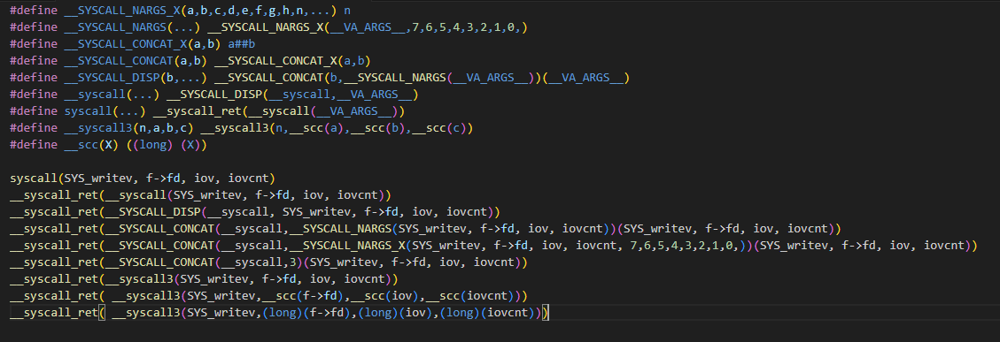

# 实验 3：进程与线程

**邬天行 522030910206**

---

> 练习题 1: 在 `kernel/object/cap_group.c` 中完善 `sys_create_cap_group`、`create_root_cap_group` 函数. 

两个函数结构相似, 依次完成 `cap_group` 的分配, `cap_group` 的初始化, `vmspace` 的分配即可. 

```c
cap_t sys_create_cap_group(unsigned long cap_group_args_p)
{
        ...
        /* cap current cap_group */
        /* LAB 3 TODO BEGIN */
        /* Allocate a new cap_group object */
        new_cap_group = obj_alloc(TYPE_CAP_GROUP, sizeof(*new_cap_group));
        /* LAB 3 TODO END */
        ...
        /* LAB 3 TODO BEGIN */
        /* initialize cap group from user*/
        cap_group_init_user(new_cap_group, BASE_OBJECT_NUM, &args);
        new_cap_group->pid =args.pid; 
        /* LAB 3 TODO END */
        ...
        /* 2st cap is vmspace */
        /* LAB 3 TODO BEGIN */
        vmspace = obj_alloc(TYPE_VMSPACE, sizeof(*vmspace));
        /* LAB 3 TODO END */
		...
}
```

```c
struct cap_group *create_root_cap_group(char *name, size_t name_len)
{
        struct cap_group *cap_group = NULL;
        struct vmspace *vmspace = NULL;
        cap_t slot_id;

        /* LAB 3 TODO BEGIN */
        cap_group = obj_alloc(TYPE_CAP_GROUP, sizeof(*cap_group));
        /* LAB 3 TODO END */
        BUG_ON(!cap_group);

        /* LAB 3 TODO BEGIN */
        /* initialize cap group with common, use ROOT_CAP_GROUP_BADGE */
        cap_group_init_common(cap_group, BASE_OBJECT_NUM, ROOT_CAP_GROUP_BADGE);
        /* LAB 3 TODO END */
        slot_id = cap_alloc(cap_group, cap_group);

        BUG_ON(slot_id != CAP_GROUP_OBJ_ID);

        /* LAB 3 TODO BEGIN */
        vmspace = obj_alloc(TYPE_VMSPACE, sizeof(*vmspace));
        /* LAB 3 TODO END */
        BUG_ON(!vmspace);

        /* fixed PCID 1 for root process, PCID 0 is not used. */
        vmspace_init(vmspace, ROOT_PROCESS_PCID);

        /* LAB 3 TODO BEGIN */
        slot_id = cap_alloc(cap_group, vmspace);
        /* LAB 3 TODO END */
		...
}
```

---

> 练习题 2: 在 `kernel/object/thread.c` 中完成 `create_root_thread` 函数, 将用户程序 ELF 加载到刚刚创建的进程地址空间中. 

参考函数内读取`flags`的方式, 先从每个 `program header` 中读取 `offset`、`vaddr`、`filesz` 和 `memsz` 四个信息. 

```c
/* LAB 3 TODO BEGIN */
/* Get offset, vaddr, filesz, memsz from image*/
memcpy(data,
        (void *)((unsigned long)&binary_procmgr_bin_start
                + ROOT_PHDR_OFF + i * ROOT_PHENT_SIZE
                + PHDR_OFFSET_OFF),
        sizeof(data));
offset = (unsigned long)le64_to_cpu(*(u64 *)data);

memcpy(data,
        (void *)((unsigned long)&binary_procmgr_bin_start
                + ROOT_PHDR_OFF + i * ROOT_PHENT_SIZE
                + PHDR_VADDR_OFF),
        sizeof(data));
vaddr = (unsigned long)le64_to_cpu(*(u64 *)data);

memcpy(data,
        (void *)((unsigned long)&binary_procmgr_bin_start
                + ROOT_PHDR_OFF + i * ROOT_PHENT_SIZE
                + PHDR_FILESZ_OFF),
        sizeof(data));
filesz = (unsigned long)le64_to_cpu(*(u64 *)data);

memcpy(data,
        (void *)((unsigned long)&binary_procmgr_bin_start
                + ROOT_PHDR_OFF + i * ROOT_PHENT_SIZE
                + PHDR_MEMSZ_OF),
        sizeof(data));
memsz = (unsigned long)le64_to_cpu(*(u64 *)data);
/* LAB 3 TODO END */
```

然后根据 `memsz` 在 `root_cap_group` 内分配指定大小的 `segment_pmo`
(`create_pmo`函数会自动做一次round_up将大小对其到物理页大小的倍数), 
并接着根据 `offset` 和 `filesz` 将 ELF 文件加载到内存中. 

```c
ret = create_pmo(memsz,
                PMO_DATA, 
                root_cap_group, 
                0, 
                &segment_pmo, 
                PMO_ALL_RIGHTS);
/* LAB 3 TODO END */

BUG_ON(ret < 0);

/* LAB 3 TODO BEGIN */
/* Copy elf file contents into memory*/
memcpy((void *)phys_to_virt(segment_pmo->start),
        (void *)((unsigned long)&binary_procmgr_bin_start
                + offset),
        filesz);
```

最后根据 `flags` 构造 `vmr_flags`, 结合 `vaddr` 创建页表映射. 

```c
/* LAB 3 TODO BEGIN */
/* Set flags*/
if (flags & PHDR_FLAGS_R) vmr_flags |= VMR_READ;
if (flags & PHDR_FLAGS_W) vmr_flags |= VMR_WRITE;
if (flags & PHDR_FLAGS_X) vmr_flags |= VMR_EXEC;
/* LAB 3 TODO END */
```

---

> 练习题 3: 在 `kernel/arch/aarch64/sched/context.c` 中完成 `init_thread_ctx` 函数, 完成线程上下文的初始化. 

依次修改线程上下文中 `SP_EL0`、`ELR_EL1` 和 `SPSR_EL1` 寄存器即可. 

```c
/* LAB 3 TODO BEGIN */
/* SP_EL0, ELR_EL1, SPSR_EL1*/
thread->thread_ctx->ec.reg[SP_EL0] = stack;
thread->thread_ctx->ec.reg[ELR_EL1] = func;
thread->thread_ctx->ec.reg[SPSR_EL1] = SPSR_EL1_EL0t;
/* LAB 3 TODO END */
```

---

> 思考题 4: 思考内核从完成必要的初始化到第一次切换到用户态程序的过程是怎么样的？尝试描述一下调用关系. 

函数调用顺序以及调用栈如下：
- `create_root_thread`: 创建首个进程
  - `memcpy`: 从二进制文件中读取内容用于后续elf文件处理和`prepare_env` 
  - `create_root_cap_group`: 创建root_cap_group
    - `obj_alloc` + `cap_group_init_common`: 分配并初始化cap_group
    - `obj_alloc` + `vmspace_init`: 分配并初始化虚拟地址空间
  - `obj_get`: 得到root_cap_group的虚拟地址空间
  - `create_pmo`: 分配物理内存对象作为root_cap_group的用户栈
  - `vmspace_map_range`: 映射root_cap_group的虚拟地址
  - `obj_alloc`: 创建进程
  - 在for loop内: 对每个elf条目操作
    - `memcpy`: 读取程序头部表部分
    - `create_pmo`: 分配段物理内存对象
    - `memcpy`: 将elf文件内容复制进入内存中
    - `vmspace_map_range`: 映射地址到root_cap_group的虚拟地址空间
  - `commit_page_to_pmo`: 将物理页分配给物理内存对象
  - `prepare_env`: 给LibC提供相关环境
  - `thread_init` + `cap_alloc` + `obj_get`: 从root_cap_group分配并初始化进程
- `sched`: 进行首次调度, 选中首个用户线程
- `eret_to_thread(switch_context())`: 返回用户态
  - `switch_context`: 用于切换上下文
---

> 练习题 5: 按照前文所述的表格填写 `kernel/arch/aarch64/irq/irq_entry.S` 中的异常向量表, 并且增加对应的函数跳转操作. 

根据注释填写异常向量表：

```assembly
/* LAB 3 TODO BEGIN */
exception_entry	sync_el1t
exception_entry	irq_el1t
exception_entry	fiq_el1t
exception_entry	error_el1t
exception_entry	sync_el1h
exception_entry	irq_el1h
exception_entry	fiq_el1h
exception_entry	error_el1h
exception_entry	sync_el0_64
exception_entry	irq_el0_64
exception_entry	fiq_el0_64
exception_entry	error_el0_64
exception_entry	sync_el0_32
exception_entry	irq_el0_32
exception_entry	fiq_el0_32
exception_entry	error_el0_32
/* LAB 3 TODO END */
```

对于 `irq_el1t`、`fiq_el1t`、`fiq_el1h`、`error_el1t`、
`error_el1h`、`sync_el1t`, 利用 `unexpected_handler` 函数处理异常;
而对于`sync_el1h`则利用 `handle_entry_c` 函数处理异常, 将数据存入内核栈对应位置

```assembly
irq_el1t:
fiq_el1t:
fiq_el1h:
error_el1t:
error_el1h:
sync_el1t:
	/* LAB 3 TODO BEGIN */
	bl unexpected_handler
	/* LAB 3 TODO END */

sync_el1h:
	exception_enter
	mov	x0, #SYNC_EL1h
	mrs	x1, esr_el1
	mrs	x2, elr_el1

	/* LAB 3 TODO BEGIN */
	/* jump to handle_entry_c, store the return value as the ELR_EL1 */
	bl handle_entry_c
	str x0, [sp, #16 * 16]
	/* LAB 3 TODO END */
	exception_exit
```

---

> 练习题 6: 填写 `kernel/arch/aarch64/irq/irq_entry.S` 中的 `exception_enter` 与 `exception_exit`, 实现上下文保存的功能, 以及 `switch_to_cpu_stack` 内核栈切换函数. 

对于 `exception_enter` 函数, 在栈上先保存`x0`到`x29`通用寄存器, 
再保存`x30`和`SP_EL0`、`ELR_EL1` 和 `SPSR_EL1` 寄存器; 
`exception_exit`函数反向操作即可.

```assembly
.macro	exception_enter

	/* LAB 3 TODO BEGIN */
	sub sp, sp, #ARCH_EXEC_CONT_SIZE
	stp x0, x1, [sp, #16 * 0]
	stp x2, x3, [sp, #16 * 1]
	stp x4, x5, [sp, #16 * 2]
	stp x6, x7, [sp, #16 * 3]
	stp x8, x9, [sp, #16 * 4]
	stp x10, x11, [sp, #16 * 5]
	stp x12, x13, [sp, #16 * 6]
	stp x14, x15, [sp, #16 * 7]
	stp x16, x17, [sp, #16 * 8]
	stp x18, x19, [sp, #16 * 9]
	stp x20, x21, [sp, #16 * 10]
	stp x22, x23, [sp, #16 * 11]
	stp x24, x25, [sp, #16 * 12]
	stp x26, x27, [sp, #16 * 13]
	stp x28, x29, [sp, #16 * 14]
	/* LAB 3 TODO END */

	mrs	x21, sp_el0
	mrs	x22, elr_el1
	mrs	x23, spsr_el1

	/* LAB 3 TODO BEGIN */
	stp x30, x21, [sp, #16 * 15]
	stp x22, x23, [sp, #16 * 16]
	/* LAB 3 TODO END */

.endm

.macro	exception_exit

	/* LAB 3 TODO BEGIN */
	ldp x30, x21, [sp, #16 * 15]
	ldp x22, x23, [sp, #16 * 16]
	/* LAB 3 TODO END */

	msr	sp_el0, x21
	msr	elr_el1, x22
	msr	spsr_el1, x23

	/* LAB 3 TODO BEGIN */
	ldp x0, x1, [sp, #16 * 0]
	ldp x2, x3, [sp, #16 * 1]
	ldp x4, x5, [sp, #16 * 2]
	ldp x6, x7, [sp, #16 * 3]
	ldp x8, x9, [sp, #16 * 4]
	ldp x10, x11, [sp, #16 * 5]
	ldp x12, x13, [sp, #16 * 6]
	ldp x14, x15, [sp, #16 * 7]
	ldp x16, x17, [sp, #16 * 8]
	ldp x18, x19, [sp, #16 * 9]
	ldp x20, x21, [sp, #16 * 10]
	ldp x22, x23, [sp, #16 * 11]
	ldp x24, x25, [sp, #16 * 12]
	ldp x26, x27, [sp, #16 * 13]
	ldp x28, x29, [sp, #16 * 14]
	add sp, sp, #ARCH_EXEC_CONT_SIZE
	/* LAB 3 TODO END */

	eret
.endm
```

对于 `switch_to_cpu_stack` 函数, 
我们将 `TPIDR_EL1` 寄存器所保存的地址加上偏移量 `OFFSET_LOCAL_CPU_STACK` 即可得到sp需要返回的地址.

```assembly
.macro switch_to_cpu_stack
	mrs     x24, TPIDR_EL1
	/* LAB 3 TODO BEGIN */
	add	x24, x24, #OFFSET_LOCAL_CPU_STACK
	/* LAB 3 TODO END */
	ldr	x24, [x24]
	mov	sp, x24
.endm
```

---

> 思考题 7: 尝试描述 `printf` 如何调用到 `chcore_stdout_write` 函数. 

`printf` 函数调用了 `vfprintf`, 
其中文件描述符参数为 `stdout. `
这说明在 `vfprintf` 中将使用 `stdout` 的某些操作函数. 

在`user/chcore-libc/musl-libc/src/stdio/stdout.c`中可以看到
`stdout` 的 `write` 操作被定义为 `__stdout_write`. 
```c
hidden FILE __stdout_FILE = {
	...
	.write = __stdout_write,
	...
};
FILE *const stdout = &__stdout_FILE;
```

走入`__stdout_write`函数:


再走入`__stdio_write`函数:


可以看到调用了syscall, 此时根据对应的宏定义则等效为:


相关的函数在`user/chcore-libc/libchcore/porting/overrides/src/chcore-port/syscall_dispatcher.c`中:
```c
long __syscall3(long n, long a, long b, long c)
{
        ...
        case SYS_writev: {
                return __syscall6(SYS_writev, a, b, c, 0, 0, 0);
        }
        ...
}

long __syscall6(long n, long a, long b, long c, long d, long e, long f)
{
        ...
        case SYS_writev: {
                return chcore_writev(a, (const struct iovec *)b, c);
        }
        ...
}
```

走入`chcore_writev`函数:
```c
ssize_t chcore_writev(int fd, const struct iovec *iov, int iovcnt)
{
        ...
        for (iov_i = 0; iov_i < iovcnt; iov_i++) {
                ret = chcore_write(fd,
                                   (void *)((iov + iov_i)->iov_base),
                                   (size_t)(iov + iov_i)->iov_len);
                ...
        }
        ...
}
```

再走入`chcore_write`函数:

```c
ssize_t chcore_write(int fd, void *buf, size_t count)
{
        if (fd < 0 || fd_dic[fd] == 0)
                return -EBADF;
        return fd_dic[fd]->fd_op->write(fd, buf, count);
}
```
观察到调用了一个write函数, 查看对应的结构体和方法:

```c
struct fd_desc {
        ...
        struct fd_ops *fd_op;
        ...
};

struct fd_ops {
        ...
        ssize_t (*write)(int fd, void *buf, size_t count);
        ...
};

extern struct fd_ops stdout_ops;
```

由于使用的是stdout, 则观察对应函数指针初始化定义:

```c
struct fd_ops stdout_ops = {
        ...
        .write = chcore_stdout_write,
        ...
};
```

查看`chcore_stdout_write`函数:

```c
static ssize_t chcore_stdout_write(int fd, void *buf, size_t count)
{
        /* TODO: stdout should also follow termios flags */
        char buffer[STDOUT_BUFSIZE];
        size_t size = 0;

        for (char *p = buf; p < (char *)buf + count; p++) {
                if (size + 2 > STDOUT_BUFSIZE) {
                        put(buffer, size);
                        size = 0;
                }

                if (*p == '\n') {
                        buffer[size++] = '\r';
                }
                buffer[size++] = *p;
        }

        if (size > 0) {
                put(buffer, size);
        }

        return count;
}
```
可以看到核心是`put`函数.

综上, 函数调用栈如下：
`printf` -> `vfprintf` -> `stdout->write` = `__stdout_write` -> `__stdio_write` -> `__syscall3` -> `__syscall6` -> `fd_desc.fd_ops.write` = `chcore_stdout_write` -> `put` -> `chcore_syscall2`

---

> 练习题 8: 在其中添加一行以完成系统调用, 目标调用函数为内核中的 `sys_putstr`. 使用 `chcore_syscallx` 函数进行系统调用. 

利用 `chcore_syscall2` 函数, 将 `buffer` 和 `size` 作为参数传入 `CHCORE_SYS_putstr` 系统调用即可. 

```c
/* LAB 3 TODO BEGIN */
chcore_syscall2(CHCORE_SYS_putstr, (vaddr_t)buffer, size);
/* LAB 3 TODO END */
```
---

> 练习题 9: 尝试编写一个简单的用户程序, 其作用至少包括打印以下字符(测试将以此为得分点). 
>```
> Hello ChCore!
>```
> 使用 chcore-libc 的编译器进行对其进行编译, 编译输出文件名命名为 `hello_chcore.bin`, 并将其放入 ramdisk 加载进内核运行. 内核启动时将自动运行 文件名为 `hello_chcore.bin` 的可执行文件. 


我们编写一个程序 `test_chcore.c`
```c
# include "build/chcore-libc/include/stdio.h"
int main()
{
    printf("\nHello ChCore! Love from OS\n");
    return 0;
}
```

利用如下命令, 使用 ChCore 的编译工具链编译 `test_chcore.c`, 并将二进制文件放入 `ramdisk` 目录,

```bash
./build/chcore-libc/bin/musl-gcc test_chcore.c -o ./ramdisk/hello_world.bin
```

至此, 运行 `make qemu` 可以正常进入 `shell`, 运行 `make grade` (由于编译时间过长, 评测时TIMEOUT 调整为100)可以通过所有测试. 


