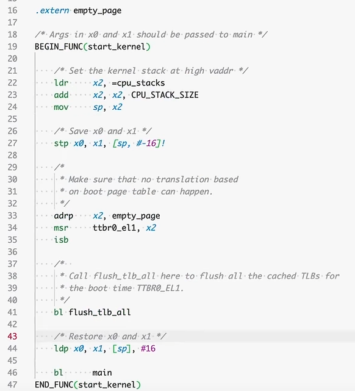
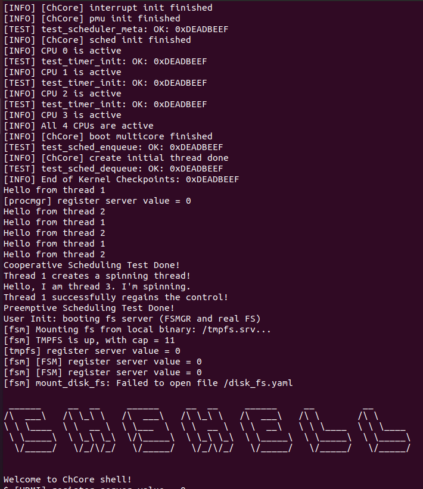
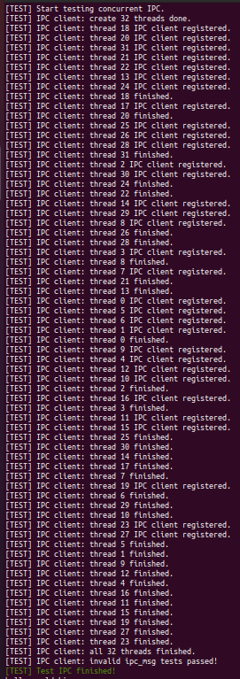
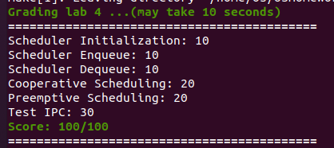
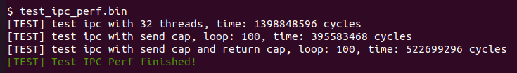

# 实验 4: 多核、多进程、调度与IPC

**邬天行 522030910206**

---

> 思考题 1: 阅读`Lab1`中的汇编代码 `kernel/arch/aarch64/boot/raspi3/init/start.S`, 说明 ChCore 是如何选定主 CPU, 并阻塞其他其他 CPU 的执行的.

(ps. 此事在Lab1思考题1中亦有记载)

考虑`_start` 的前三行代码: 

```assembly
mrs	x8, mpidr_el1
and	x8, x8,	#0xFF
cbz	x8, primary
```

`mpidr_el1` 寄存器的低 8 位表示多核处理器中的唯一ID, 程序仅允许这个变量为 0 的CPU进入`primary` 函数率先初始化, 剩余的CPU会在 `wait_for_bss_clear` 和 `wait_until_smp_enabled`两个函数中被暂时挂起直到 `clear_bss_flag` 以及 `secondary_boot_flag` 两个变量分别满足条件后继续执行.

---

> 思考题 2: 阅读汇编代码 `kernel/arch/aarch64/boot/raspi3/init/start.S`, `init_c.c` 以及 `kernel/arch/aarch64/main.c`, 解释用于阻塞其他 CPU 核心的 `secondary_boot_flag` 是物理地址还是虚拟地址, 是如何传入函数 `enable_smp_cores`中, 又是如何赋值的（考虑虚拟地址/物理地址）.

三个文件源码分别位于Lab1,Lab1,Lab2中.

(ps. 其中涉及到了kernel/arch/aarch64/head.S, 但是Lab1-4中均没有源码而只有对应的.obj文件, 可以在Lab4下执行Lab0中已经学会的


`aarch64-linux-gnu-objdump -D ../Lab1/kernel/arch/aarch64/head.S.dbg.obj > head.S`

得到该文件从而获取部分信息)


顺着`start.S`往下走:
```assembly
primary:

	/* Turn to el1 from other exception levels. */
	bl 	arm64_elX_to_el1

	/* Prepare stack pointer and jump to C. */
	/*
	x0 = the address of label boot_cpu_stack
	x0 move up for space for stack
	sp = stack pointer (bottom)
	*/
	adr 	x0, boot_cpu_stack
	add 	x0, x0, #INIT_STACK_SIZE
	mov 	sp, x0

	b 	init_c

	/* Should never be here */
	b	.
END_FUNC(_start)

```
可以看到主CPU在将特权级设为EL1, 启动CPU栈后进入了init_c.

```c
void init_c(void)
{
	/* Clear the bss area for the kernel image */
	clear_bss();

	/* Initialize UART before enabling MMU. */
	early_uart_init();
	uart_send_string("boot: init_c\r\n");

	wakeup_other_cores();

	/* Initialize Kernel Page Table. */
	uart_send_string("[BOOT] Install kernel page table\r\n");
	init_kernel_pt();

	/* Enable MMU. */
	el1_mmu_activate();
	uart_send_string("[BOOT] Enable el1 MMU\r\n");

	/* Call Kernel Main. */
	uart_send_string("[BOOT] Jump to kernel main\r\n");
	start_kernel(secondary_boot_flag);

	/* Never reach here */
}
```

在去除日志信息后可以看到函数的执行流程是:

`clear_bss` -> `wakeup_other_cores` -> `init_kernel_pt` -> `el1_mmu_activate` -> `start_kernel`

先进入`clear_bss`:

```c
static void clear_bss(void)
{
	u64 bss_start_addr;
	u64 bss_end_addr;
	u64 i;

	bss_start_addr = (u64)&_bss_start;
	bss_end_addr = (u64)&_bss_end;

	for (i = bss_start_addr; i < bss_end_addr; ++i)
		*(char *)i = 0;

	clear_bss_flag = 0;
}
```

可以看到将clear_bss_flag设为了0

在 `wakeup_other_cores`中唤醒了其他CPU继续执行_start函数, 此时bss已经为0, 则副CPU在同样地将特权级设为EL1, 启动CPU栈操作后进入wait_until_smp段

进入`start_kernel`函数: 



可以看到在处理了页表和TLB相关内容后最终进入了`main`函数:

```c
void main(paddr_t boot_flag, void *info)
{
	...

	/* Other cores are busy looping on the boot_flag, wake up those cores */
	enable_smp_cores(boot_flag);

	...
	create_root_thread();
	...

	/* Leave the scheduler to do its job */
	sched();

	/* Context switch to the picked thread */
	eret_to_thread(switch_context());

	/* Should provide panic and use here */
	BUG("[FATAL] Should never be here!\n");
}
```

可以看到在函数中先执行`enable_smp_cores`函数, 然后创建root线程并eret

进入`enable_smp_cores`函数: 

```c
void enable_smp_cores(paddr_t boot_flag)
{
	int i = 0;
	long *secondary_boot_flag;

	/* Set current cpu status */
	cpu_status[smp_get_cpu_id()] = cpu_run;
	secondary_boot_flag = (long *)phys_to_virt(boot_flag);
	for (i = 0; i < PLAT_CPU_NUM; i++) {
		secondary_boot_flag[i] = 1;
		flush_dcache_area((u64) secondary_boot_flag,
				  (u64) sizeof(u64) * PLAT_CPU_NUM);
		asm volatile ("dsb sy");
		while (cpu_status[i] == cpu_hang)
		;
		kinfo("CPU %d is active\n", i);
	}
	/* wait all cpu to boot */
	kinfo("All %d CPUs are active\n", PLAT_CPU_NUM);
	init_ipi_data();
}
```

可以看到此时`secondary_boot_flag`全体被赋值为1,此时所有副CPU可以继续进入`secondary_init_c`函数: 

```c
void secondary_init_c(int cpuid)
{
	el1_mmu_activate();
	secondary_cpu_boot(cpuid);
}
```

在`secondary_cpu_boot`中, 函数表现与`start_kernel`函数相似, 在处理了页表和TLB相关内容后最终进入了`secondary_start`函数, 该函数表现与`main`类似, 最终也进行eret

至此可以画出整个CPU群组的初始化流程: 

.png>)

现在回来看问题: 

`secondary_boot_flag` 在`enable_smp_cores`代码中为物理地址转虚拟地址, 且此时所有虚拟地址相关内容并未初始化, 因此传入时为物理地址, 而最终全部被修改为1后, 以虚拟地址传出

反向追溯该变量路径: 

`enable_smp_cores`中的`boot_flag`接受的为来自`main`函数的物理地址

`main`函数直接接受来自`start_kernel`中的`secondary_boot_flag`变量, 且该变量在进入该函数前后直接存在栈上, 并未被改变过, 为物理地址.

`init_c`中该变量被初始化, 为物理地址

---

> 练习题 1: 在 `kernel/sched/policy_rr.c` 中完善 `rr_sched_init` 函数, 对 `rr_ready_queue_meta` 进行初始化.


先看该变量对应的结构体代码: 

```c
struct queue_meta {
    struct list_head queue_head;
    unsigned int queue_len;
    struct lock queue_lock;
    char pad[pad_to_cache_line(sizeof(unsigned int)
                            + sizeof(struct list_head)
                            + sizeof(struct lock))];
};

struct queue_meta rr_ready_queue_meta[PLAT_CPU_NUM];
```

利用循环遍历每个CPU, 针对不同的结构体调用对应的初始化函数即可.

```c
int rr_sched_init(void)
{
        /* LAB 4 TODO BEGIN (exercise 1) */
        /* Initial the ready queues (rr_ready_queue_meta) for each CPU core */
        for (int i=0;i<PLAT_CPU_NUM;i++)
        {
                init_list_head(&(rr_ready_queue_meta[i].queue_head));
                rr_ready_queue_meta[i].queue_len = 0;
                lock_init(&(rr_ready_queue_meta[i].queue_lock));
        }
        /* LAB 4 TODO END (exercise 1) */

        lab4_test_scheduler_meta();
        return 0;
}
```

---

> 练习题 2: 在 `kernel/sched/policy_rr.c` 中完善 `__rr_sched_enqueue` 函数, 将 `thread` 插入到 `cpuid` 对应的就绪队列中.

直接使用`list_append`将线程加入相应队列中, 并维护对应的长度信息

```c
int __rr_sched_enqueue(struct thread *thread, int cpuid)
{
        ...
        /* LAB 4 TODO BEGIN (exercise 2) */
        /* Insert thread into the ready queue of cpuid and update queue length */
        /* Note: you should add two lines of code. */
        list_append(&(thread->ready_queue_node), &(rr_ready_queue_meta[cpuid].queue_head));
        rr_ready_queue_meta[cpuid].queue_len++;
        /* LAB 4 TODO END (exercise 2) */

        return 0;
}
```

---

> 练习题 3: 在 `kernel/sched/sched.c` 中完善 `find_runnable_thread` 函数, 在就绪队列中找到第一个满足运行条件的线程并返回. 在 `kernel/sched/policy_rr.c` 中完善 `__rr_sched_dequeue` 函数, 将被选中的线程从就绪队列中移除.


`__rr_sched_dequeue` 函数直接仿照 `__rr_sched_enqueue`: 

```c
int __rr_sched_dequeue(struct thread *thread)
{
        ...

        /* LAB 4 TODO BEGIN (exercise 3) */
        /* Delete thread from the ready queue and upate the queue length */
        /* Note: you should add two lines of code. */
        list_del(&(thread->ready_queue_node));
        rr_ready_queue_meta[thread->thread_ctx->cpuid].queue_len--;
        /* LAB 4 TODO END (exercise 3) */
        obj_put(thread);
        return 0;
}
```


对于 `find_runnable_thread` 函数, 需要先理解`for_each_in_list`宏的使用

参考定义: 

```c
#define for_each_in_list(elem, type, field, head) \
	for ((elem) = container_of((head)->next, type, field); \
	     &((elem)->field) != (head); \
	     (elem) = container_of(((elem)->field).next, type, field))

#define container_of(ptr, type, field) \
    ((type *)((void *)(ptr) - (void *)(&(((type *)(0))->field))))
```

Lab2中已经告诉我们, `container_of(ptr, type, field)` 是 `ptr作为[type结构体的field成员]的指针 对应的 type结构体指针`, 而elem在这里是循环变量

起始条件: `elem = container_of(head->next, type, field)`, `elem`是一个`type`结构体指针, `head`是一个循环链表中不行使功能的表头
终止条件: `&(elem->field) != head`, `elem`自身的`field`成员如果为`head`则说明已经回到表头
迭代条件: `elem = container_of((elem->field).next, type, field)`, 每次让`elem`取下一个成员, 并重新转换为`type`结构体指针

因此, 调用 `for_each_in_list` 遍历队列, 找到第一个满足条件的线程即可.

```c
struct thread *find_runnable_thread(struct list_head *thread_list)
{
        struct thread *thread = NULL;

        /* LAB 4 TODO BEGIN (exercise 3) */
        /* Tip 1: use for_each_in_list to iterate the thread list */
        /*
         * Tip 2: Find the first thread in the ready queue that
         * satisfies (!thread->thread_ctx->is_suspended && 
         * (thread->thread_ctx->kernel_stack_state == KS_FREE
         * || thread == current_thread))
         */
        for_each_in_list(thread, struct thread, ready_queue_node, thread_list) 
        {
                if (!thread->thread_ctx->is_suspended && 
                (thread->thread_ctx->kernel_stack_state == KS_FREE || thread == current_thread)) 
                {
                        return thread;
                }
        }

        /* LAB 4 TODO END (exercise 3) */
        return thread;
}
```


---

> 练习题 4: 在 `kernel/sched/sched.c` 中完善系统调用 `sys_yield`, 使用户态程序可以主动让出 CPU 核心触发线程调度.
> 此外, 请在 `kernel/sched/policy_rr.c` 中完善 `rr_sched` 函数, 将当前运行的线程重新加入调度队列中.

对于 `sys_yield` 函数, 直接调用 `sched` 函数触发调度.

```c
void sys_yield(void)
{
        current_thread->thread_ctx->sc->budget = 0;
        /* LAB 4 TODO BEGIN (exercise 4) */
        /* Trigger sched */
        /* Note: you should just add a function call (one line of code) */
        sched();
        /* LAB 4 TODO END (exercise 4) */
        eret_to_thread(switch_context());
}
```

对于 `rr_sched` 函数, 调用 `rr_sched_enqueue` 将线程重新加入队列.

```c
int rr_sched(void)
{
        ...

        if (old) {
                ...

                /* check old state */
                if (!thread_is_exited(old)) {
                        if (thread_is_ts_running(old)) {
                                ...
                        /* LAB 4 TODO BEGIN (exercise 4) */
                        /* Refill budget for current running thread (old) and enqueue the current thread.*/
                                rr_sched_enqueue(old);
                        /* LAB 4 TODO END (exercise 4) */

                        } else if (!thread_is_ts_blocking(old)
                                   && !thread_is_ts_waiting(old)) {
                                ...
                        }
                }
        }

        ...
}
```

---

> 练习题 5: 请根据代码中的注释在 `kernel/arch/aarch64/plat/raspi3/irq/timer.c` 中完善 `plat_timer_init` 函数, 初始化物理时钟.需要完成的步骤有: 
> * 读取 `CNTFRQ_EL0` 寄存器, 为全局变量 `cntp_freq` 赋值.
> * 根据 `TICK_MS`（由 ChCore 决定的时钟中断的时间间隔, 以 ms 为单位, ChCore 默认每 10ms 触发一次时钟中断）和 `cntfrq_el0`（即物理时钟的频率）计算每两次时钟中断之间 `system count` 的增长量, 将其赋值给 `cntp_tval` 全局变量, 并将 `cntp_tval` 写入 `CNTP_TVAL_EL0` 寄存器.
> * 根据上述说明配置控制寄存器 `CNTP_CTL_EL0`.

对于`cntp_tval`, 考虑到时钟单位为ms, 因此要将`cntp_freq`转化为ms再进行计算.
对于`time_ctl`, 由于需要启用时钟因此需要直接将最后一位设置为1.
最后用 `asm` 函数的汇编指令读写寄存器即可.

```c
void plat_timer_init(void)
{
	u64 timer_ctl = 0;
	u32 cpuid = smp_get_cpu_id();

	/* Since QEMU only emulate the generic timer, we use the generic timer here */
	asm volatile ("mrs %0, cntpct_el0":"=r" (cntp_init));
	kdebug("timer init cntpct_el0 = %lu\n", cntp_init);

	/* LAB 4 TODO BEGIN (exercise 5) */
	/* Note: you should add three lines of code. */
	/* Read system register cntfrq_el0 to cntp_freq*/
	asm volatile ("mrs %0, cntfrq_el0":"=r" (cntp_freq));
	/* Calculate the cntp_tval based on TICK_MS and cntp_freq */
	cntp_tval = cntp_freq / 1000 * TICK_MS;
	/* Write cntp_tval to the system register cntp_tval_el0 */
	asm volatile ("msr cntp_tval_el0, %0"::"r" (cntp_tval));
	/* LAB 4 TODO END (exercise 5) */


	tick_per_us = cntp_freq / 1000 / 1000;
	/* Enable CNTPNSIRQ and CNTVIRQ */
	put32(core_timer_irqcntl[cpuid], INT_SRC_TIMER1 | INT_SRC_TIMER3);

	/* LAB 4 TODO BEGIN (exercise 5) */
	/* Note: you should add two lines of code. */
	/* Calculate the value of timer_ctl */
	timer_ctl = 1;
	/* Write timer_ctl to the control register (cntp_ctl_el0) */
	asm volatile ("msr cntp_ctl_el0, %0"::"r" (timer_ctl));
	/* LAB 4 TODO END (exercise 5) */
	lab4_test_timer_init();
	return;
}
```

---

> 练习题 6: 请在 `kernel/arch/aarch64/plat/raspi3/irq/irq.c` 中完善 `plat_handle_irq` 函数, 当中断号 `irq` 为 `INT_SRC_TIMER1`（代表中断源为物理时钟）时调用 `handle_timer_irq` 并返回.
> 请在 `kernel/irq/irq.c` 中完善 `handle_timer_irq` 函数, 递减当前运行线程的时间片 `budget`, 并调用 `sched` 函数触发调度.
> 请在 `kernel/sched/policy_rr.c` 中完善 `rr_sched` 函数, 在将当前运行线程重新加入就绪队列之前, 恢复其调度时间片 `budget` 为 `DEFAULT_BUDGET`.


对于 `plat_handle_irq` 函数, 当中断号为 `INT_SRC_TIMER1` 时调用 `handle_timer_irq` 函数并返回.

```c
void plat_handle_irq(void)
{
	...
	switch (irq) {
	/* LAB 4 TODO BEGIN (exercise 6) */
	/* Call handle_timer_irq and return if irq equals INT_SRC_TIMER1 (physical timer) */
	case INT_SRC_TIMER1:
		handle_timer_irq();
		return;
	/* LAB 4 TODO END (exercise 6) */
	default:
		// kinfo("Unsupported IRQ %d\n", irq);
		break;
	}

	...
}

```

对于 `handle_timer_irq` 函数, 递减当前线程的时间片即可, 注意不要调用 `sched` 函数.

```c
void handle_timer_irq(void)
{
        ...
        /* LAB 4 TODO BEGIN (exercise 6) */
        /* Decrease the budget of current thread by 1 if current thread is not NULL */
        /* We will call the sched_periodic in the caller handle_irq so no need to call sched() now. */
        if(current_thread)
        {
                current_thread->thread_ctx->sc->budget--;
        }
        /* LAB 4 TODO END (exercise 6) */
}

```

对于 `rr_sched` 函数, 将线程时间片重置为 `DEFAULT_BUDGET` 即可.

```c
int rr_sched(void)
{
        ...

        if (old) {
                ...

                /* check old state */
                if (!thread_is_exited(old)) {
                        if (thread_is_ts_running(old)) {
                                ...
                        /* LAB 4 TODO BEGIN (exercise 4) */
                        /* Refill budget for current running thread (old) and enqueue the current thread.*/
                                old->thread_ctx->sc->budget = DEFAULT_BUDGET;
                                rr_sched_enqueue(old);
                        /* LAB 4 TODO END (exercise 4) */

                        } else if (!thread_is_ts_blocking(old)
                                   && !thread_is_ts_waiting(old)) {
                                ...
                        }
                }
        }

        ...
}

/* LAB 4 TODO BEGIN (exercise 7) */
/* Complete the config structure, replace xxx with actual values */
/* Record the ipc_routine_entry  */
config->declared_ipc_routine_entry = ipc_routine;

/* Record the registration cb thread */
config->register_cb_thread = register_cb_thread;
/* LAB 4 TODO END (exercise 7) */
```


> 练习题 7: 在 `user/chcore-libc/musl-libc/src/chcore-port/ipc.c` 与 `kernel/ipc/connection.c` 中实现了大多数 IPC 相关的代码, 请根据注释补全 `kernel/ipc/connection.c` 中的代码.

根据注释依次填写变量, 完成参数传递即可.

```c
static int register_server(struct thread *server, unsigned long ipc_routine,
                           cap_t register_thread_cap, unsigned long destructor)
{
        ...

        /*
         * @ipc_routine will be the real ipc_routine_entry.
         * No need to validate such address because the server just
         * kill itself if the address is illegal.
         */
/*
         * @ipc_routine will be the real ipc_routine_entry.
         * No need to validate such address because the server just
         * kill itself if the address is illegal.
         */
        /* LAB 4 TODO BEGIN (exercise 7) */
        /* Complete the config structure, replace xxx with actual values */
        /* Record the ipc_routine_entry  */
        config->declared_ipc_routine_entry = ipc_routine;

        /* Record the registration cb thread */
        config->register_cb_thread = register_cb_thread;
        /* LAB 4 TODO END (exercise 7) */

        ...
}
```

```c
static int create_connection(struct thread *client, struct thread *server,
                             int shm_cap_client, unsigned long shm_addr_client,
                             struct client_connection_result *res)
{
        ...

        /* LAB 4 TODO BEGIN (exercise 7) */
        /* Complete the following fields of shm, replace xxx with actual values */
        conn->shm.client_shm_uaddr = shm_addr_client;
        conn->shm.shm_size = shm_size;
        conn->shm.shm_cap_in_client = shm_cap_client;
        conn->shm.shm_cap_in_server = shm_cap_server;
        /* LAB 4 TODO END (exercise 7) */

        ...
}
```


注意到`kernel/user-include/uapi/ipc.h`中有关于`server_handler`需要的参数: 

```c
/**
 * @brief This type specifies the function signature that an IPC server 
 * should follow to be properly called by the kernel.
 * 
 * @param shm_ptr: pointer to start address of IPC shared memory. Use
 * SHM_PTR_TO_CUSTOM_DATA_PTR macro to convert it to concrete custom
 * data pointer.
 * @param max_data_len: length of IPC shared memory.
 * @param send_cap_num: number of capabilites sent by client in this request.
 * @param client_badge: badge of client.
 */
typedef void (*server_handler)(void *shm_ptr, unsigned int max_data_len, unsigned int send_cap_num, badge_t client_badge);

```

```c
static void ipc_thread_migrate_to_server(struct ipc_connection *conn,
                                         unsigned long shm_addr,
                                         size_t shm_size, unsigned int cap_num)
{
        ...

        /* Set the target thread SP/IP/arguments */
        /* LAB 4 TODO BEGIN (exercise 7) */
        /*
         * Complete the arguments in the following function calls,
         * replace xxx with actual arguments.
         */

        /* Note: see how stack address and ip are get in sys_ipc_register_cb_return */
        arch_set_thread_stack(target, handler_config->ipc_routine_stack);
        arch_set_thread_next_ip(target, handler_config->ipc_routine_entry);

        /* see server_handler type in uapi/ipc.h */
        arch_set_thread_arg0(target, shm_addr);
        arch_set_thread_arg1(target, shm_size);
        arch_set_thread_arg2(target, cap_num);
        arch_set_thread_arg3(target, conn->client_badge);
        
        /* LAB 4 TODO END (exercise 7) */
        ...
```

```c
cap_t sys_register_client(cap_t server_cap, unsigned long shm_config_ptr)
{
        ...
        /* LAB 4 TODO BEGIN (exercise 7) */
        /* Set target thread SP/IP/arg, replace xxx with actual arguments */
        /* Note: see how stack address and ip are get in sys_register_server */
        arch_set_thread_stack(register_cb_thread, register_cb_config->register_cb_stack);
        arch_set_thread_next_ip(register_cb_thread, register_cb_config->register_cb_entry);

        /*
         * Note: see the parameter of register_cb function defined
         * in user/chcore-libc/musl-libc/src/chcore-port/ipc.c
         */
        arch_set_thread_arg0(register_cb_thread, server_config->declared_ipc_routine_entry);
        /* LAB 4 TODO END (exercise 7) */

        ...
}
```

```c
int sys_ipc_register_cb_return(cap_t server_handler_thread_cap,
                               unsigned long server_thread_exit_routine,
                               unsigned long server_shm_addr)
{
        ...
        /* Initialize the ipc configuration for the handler_thread (end) */

        /* LAB 4 TODO BEGIN (exercise 7) */
        /* Complete the server_shm_uaddr field of shm, replace xxx with the actual value */
        conn->shm.server_shm_uaddr = server_shm_addr;
        /* LAB 4 TODO END (exercise 7) */
        ...
}
```

---

至此, 运行 `make qemu` 可以正常进入 `shell`, 运行 `make grade` 可以通过所有测试.







> 练习题 8: 请在树莓派3B上运行ChCore, 并确保此前实现的所有功能都能正确运行.

由于没有树莓派只好继续用qemu



> 练习题 9: 尝试优化在第三部分实现的IPC的性能，降低test_ipc_perf.bin的三个测试所消耗的cycle数

难做