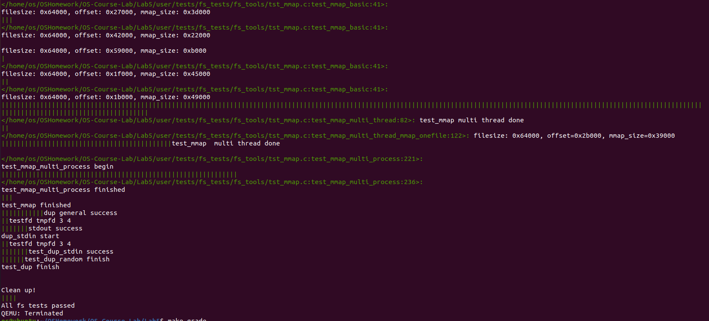
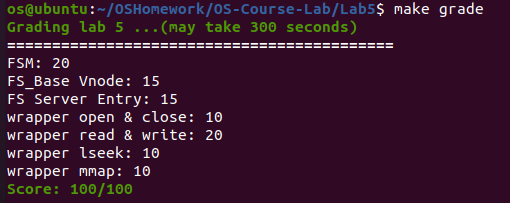

# 实验 5: 虚拟文件系统

**邬天行 522030910206**

---
> 练习题 1: 阅读 `user/chcore-libc/libchcore/porting/overrides/src/chcore-port/file.c` 的 `chcore_openat` 函数, 分析 ChCore 是如何处理 `openat` 系统调用的, 关注 IPC 的调用过程以及 IPC 请求的内容.

```c
/* When open we need to alloco fd number first and call to fs server */
int chcore_openat(int dirfd, const char *pathname, int flags, mode_t mode)
{
        struct fd_record_extension *fd_ext;
        struct fs_request *fr_ptr;
        ipc_struct_t *mounted_fs_ipc_struct;
        int ret;
        int mount_id;
        int fd;
        ipc_msg_t *ipc_msg;
        char *full_path;
        char server_path[FS_REQ_PATH_BUF_LEN];

        /*
         * Allocate a fd number first,
         * The fd will be send to fs_server to construct fd->fid mapping
         */
        if ((fd = alloc_fd()) < 0)
                return fd;

        /* Prepare full_path for IPC arguments, don't forget free(full_path) */
        ret = generate_full_path(dirfd, pathname, &full_path);
        if (ret)
                return ret;

        /* Send IPC to FSM and parse full_path */
        if (parse_full_path(full_path, &mount_id, server_path) != 0) {
                free(full_path);
                return -EINVAL;
        }

        /* Send IPC to fs_server */
        mounted_fs_ipc_struct = get_ipc_struct_by_mount_id(mount_id);
        // Fill fd record with IPC information */
        fd_ext = (struct fd_record_extension *)fd_dic[fd]->private_data;
        fd_ext->mount_id = mount_id;
        if (pathcpy(fd_ext->path, MAX_PATH_BUF_LEN, full_path, strlen(full_path))
            != 0) {
                free(full_path);
                return -EBADF;
        }
        ipc_msg = ipc_create_msg(mounted_fs_ipc_struct,
                                 sizeof(struct fs_request));
        fr_ptr = (struct fs_request *)ipc_get_msg_data(ipc_msg);

        fr_ptr->req = FS_REQ_OPEN;
        fr_ptr->open.new_fd = fd;
        if (pathcpy(fr_ptr->open.pathname,
                    FS_REQ_PATH_BUF_LEN,
                    server_path,
                    strlen(server_path))
            != 0) {
                ipc_destroy_msg(ipc_msg);
                free(full_path);
                return -EBADF;
        }
        fr_ptr->open.flags = flags;
        fr_ptr->open.mode = mode;

        ret = ipc_call(mounted_fs_ipc_struct, ipc_msg);

        if (ret >= 0) {
                fd_dic[fd]->type = FD_TYPE_FILE;
                fd_dic[fd]->fd_op = &file_ops;
                ret = fd; /* Return fd if succeed */
        } else {
                free_fd(fd);
        }

        free(full_path);
        ipc_destroy_msg(ipc_msg);

        return ret;
}
```

`chcore_openat` 函数接受四个参数: 
- `dirfd` (int): 路径描述符
- `pathname` (const char *): 路径名称
- `flags` (int), `mode` (mode_t): 文件属性信息

执行过程为: 
- 分配一个文件描述符 `fd`
- 生成完整的文件路径 `full_path`
- 对文件系统进行第一次IPC调用, 得到 `mount_id`
- 构建第二次IPC调用的信息
- 对文件系统进行第二次IPC调用, 打开这个文件

---

> 练习题 2: 实现 `user/system-services/system-servers/fsm/fsm.c` 的 `fsm_mount_fs` 函数.

根据注释填写对应代码即可, 注意要解开代码中加上的读写锁.

```c
int fsm_mount_fs(const char *path, const char *mount_point)
{
        ...

        /* Lab 5 TODO Begin (Part 1) */
        /* HINT: fsm has the ability to request page_cache syncing and mount and
         * unmount request to the corresponding filesystem. Register an ipc client for each node*/
        
        /* mp_node->_fs_ipc_struct = ipc_register_client(...) */
        mp_node -> _fs_ipc_struct = ipc_register_client(mp_node -> fs_cap);
        /* Increment the fs_num */
        fs_num++;
        /* Set the correct return value */
        ret = 0;
        // UNUSED(mp_node);
        pthread_rwlock_unlock(&mount_point_infos_rwlock);
        /* Lab 5 TODO End (Part 1) */

out:
        return ret;
}
```

---
> 练习题 3: 实现 `user/system-services/system-servers/fsm/fsm.c` 的 IPC 请求处理函数. 

按照提示, 我们首先完成`user/system-services/system-servers/fsm/fsm_client_cap.c` 中的相关函数.

按照注释提示完成 `fsm_set_client_cap` , 其中 `fsm_client_cap_node` 由 `fsm_client_cap_table` 进行数据结构为链表的管理, 我们需要遍历这个链表寻找与 `client_badge` 相同的节点, 否则需要分配新的节点并加入链表中. 

按照注释提示完成 `fsm_get_client_cap` , 我们需要遍历这个链表寻找与 `client_badge` 相同的节点, 再遍历它的 `cap_table` 寻找对应的挂载点id. 

```c
...

struct list_head fsm_client_cap_table;

/* Return mount_id */
int fsm_set_client_cap(badge_t client_badge, cap_t cap)
{
        /* Lab 5 TODO Begin (Part 1) */
        /* HINT: the fsm_client_cap_node is organized with a linked list which
         * represents a mapping between (client_badge, fs_cap) -> mount_id. You
         * should allocate the node if it's not present or get the
         * fs_client_cap_node. Iterate through the cap_table and place the cap
         * in an empty slot of the cap_table and returns its ordinal.*/
        struct fsm_client_cap_node * node = NULL;
        for_each_in_list(node, struct fsm_client_cap_node, node, &fsm_client_cap_table)
        {
                if(node -> client_badge == client_badge)
                {
                        node->cap_table[node->cap_num] = cap;
                        node -> cap_num ++;
                        return node -> cap_num - 1;
                }
        }
        node = (struct fsm_client_cap_node *) malloc (sizeof(struct fsm_client_cap_node));
        if(!node) return -1;
        node -> client_badge = client_badge;
        memset(node -> cap_table, 0, sizeof(node -> cap_table));
        node -> cap_table[0] = cap;
        node -> cap_num = 1;
        list_append(&node -> node, &fsm_client_cap_table);
        return 0;
        /* Lab 5 TODO End (Part 1) */
}

/* Return mount_id if record exists, otherwise -1 */
int fsm_get_client_cap(badge_t client_badge, cap_t cap)
{
        /* Lab 5 TODO Begin (Part 1) */
        /* HINT: Perform the same behavior as fsm_set_client_cap and gets the
         * cap from the cap_table if it exists. */
        struct fsm_client_cap_node * node = NULL;
        for_each_in_list(node, struct fsm_client_cap_node, node, &fsm_client_cap_table)
        {
                if(node -> client_badge == client_badge)
                {
                        for (int i = 0; i < node->cap_num; i++)
                                if (node->cap_table[i] == cap)
                                        return i;
                }
        }
        return -1;
        /* Lab 5 TODO End (Part 1) */
}

```

接着按照注释一步步完成IPC请求处理即可. 

```c
DEFINE_SERVER_HANDLER(fsm_dispatch)
{
        ...
        switch (fsm_req->req) {
        case FSM_REQ_PARSE_PATH: {
                /* Lab 5 TODO Begin (Part 1) */

                /* HINT: MountInfo is the info node that records each mount
                 * point and actual path*/
                /* It also contains a ipc_client that delegates the actual
                 * filesystem. PARSE_PATH is the actual vfs layer that does the
                 * path traversing */
                /* e.g. /mnt/ -> /dev/sda1 /mnt/1 -> /dev/sda2 */
                /* You should use the get_mount_point function to get
                 * mount_info. for example get_mount_info will return
                 * mount_info(/mnt/1/123) node that represents /dev/sda2.*/
                /* You should use get_mount_info to get the mount_info and set
                 * the fsm_req ipc_msg with mount_id*/

                /* lock the mount_info with rdlock */
                pthread_rwlock_rdlock(&mount_point_infos_rwlock);
                /* mpinfo = get_mount_point(..., ...) */
                mpinfo = get_mount_point(fsm_req -> path, strlen(fsm_req -> path));
                /* lock the client_cap_table with mutex */
                pthread_mutex_lock(&fsm_client_cap_table_lock); 
                /* mount_id = fsm_get_client_cap(...) */
                mount_id = fsm_get_client_cap(client_badge, mpinfo -> fs_cap);
                /* if mount_id is not present, we first register the cap set the
                 * cap and get mount_id */
                if(mount_id == -1)
                {
                        mount_id = fsm_set_client_cap(client_badge, mpinfo -> fs_cap);
                        ret_with_cap = true;
                        ipc_set_msg_return_cap_num(ipc_msg, 1);
                        ipc_set_msg_cap(ipc_msg, 0, mpinfo->fs_cap);
                }
                /* set the mount_id, mount_path, mount_path_len in the fsm_req
                 */
                fsm_req -> mount_id = mount_id;
                fsm_req -> mount_path_len = mpinfo -> path_len;
                strcpy(fsm_req -> mount_path, mpinfo -> path);
                /* Specifically if we register a new fs_cap in the cap_table, we
                 * should let the caller know with a fsm_req->new_cap_flag and
                 * then return fs_cap (noted above from mount_id) to the
                 * caller*/
                fsm_req -> new_cap_flag = ret_with_cap;
                /* Before returning to the caller , unlock the client_cap_table
                 * and mount_info_table */
                pthread_mutex_unlock(&fsm_client_cap_table_lock);
                pthread_rwlock_unlock(&mount_point_infos_rwlock);
                //UNUSED(mpinfo);
                //UNUSED(mount_id);
                /* Lab 5 TODO End (Part 1) */
                break;
        }
        ...
        }

        ...
}
```

---
> 练习题 4: 实现 `user/system-services/system-servers/fs_base/fs_vnode.c` 中 `vnode` 的 `alloc_fs_vnode`, `get_fs_vnode_by_id`, `inc_ref_fs_vnode``, dec_ref_fs_vnode` 函数. 

`vnode` 采用了红黑树的管理方式, 在 `user/chcore-libc/libchcore/porting/overrides/include/chcore/container/rbtree.h` 可以找到相关操作接口. 

对于`alloc_fs_vnode`函数, 我们首先请求`fs_vnode`, 然后填写相关字段, 最后初始化锁. 

```c
struct fs_vnode *alloc_fs_vnode(ino_t id, enum fs_vnode_type type, off_t size,
                                void *private)
{
        /* Lab 5 TODO Begin (Part 2) */
        struct fs_vnode *ret = (struct fs_vnode *)malloc(sizeof(*ret));
        if (!ret) return NULL;
        ret->vnode_id = id;
        ret->type = type;
        ret->size = size;
        ret->private = private;
        ret->refcnt = 1;
        ret->pmo_cap = -1;
        pthread_rwlock_init(&ret->rwlock, NULL);
        return ret;
        /* Lab 5 TODO End (Part 2) */
}
```

对于`get_fs_vnode_by_id`函数, 我们利用`rb_search`找到该节点在红黑树中的节点, 再返回这个红黑树节点对应的原成员. (利用`rb_entry`宏等效于`container_of`)

```c
struct fs_vnode *get_fs_vnode_by_id(ino_t vnode_id)
{
        /* Lab 5 TODO Begin (Part 2) */
        /* Use the rb_xxx api */
        struct rb_node *node =
                rb_search(fs_vnode_list, &vnode_id, comp_vnode_key);
        if (!node) return NULL;
        return rb_entry(node, struct fs_vnode, node);
        /* Lab 5 TODO End (Part 2) */
}
```

对于`inc_ref_fs_vnode`函数, 我们直接增加`refcnt`即可. 

```c
/* refcnt for vnode */
int inc_ref_fs_vnode(void *private)
{
        /* Lab 5 TODO Begin (Part 2) */
        /* Private is a fs_vnode */
        // UNUSED(private);
        ((struct fs_vnode *)private)->refcnt++;
        return 0;
        /* Lab 5 TODO End (Part 2) */
}
```

对于`dec_ref_fs_vnode`函数, 我们直接减少`refcnt`即可. 注意如果`refcnt`为0时需要关闭节点对应的文件并在红黑树上去除掉这个节点. 

```c
int dec_ref_fs_vnode(void *private)
{
        /* Lab 5 TODO Begin (Part 2) */
        /* Private is a fs_vnode Decrement its refcnt */
        //UNUSED(private);
        struct fs_vnode * node = (struct fs_vnode *)private;
        node->refcnt--;
        if (node->refcnt == 0) {
                int ret = server_ops.close(node->private, (node->type == FS_NODE_DIR), true);
                if (ret) return ret;
                pop_free_fs_vnode(node);
        }
        return 0;
        /* Lab 5 TODO End (Part 2) */
}

```

---

> 练习题 5: 实现 `user/system-services/system-servers/fs_base/fs_wrapper.c` 中的 `fs_wrapper_set_server_entry` 和 `fs_wrapper_get_server_entry` 函数. 

按照提示我们首先观察一下下面的`fs_wrapper_clear_server_entry`函数: 

```c
void fs_wrapper_clear_server_entry(badge_t client_badge, int fid)
{
        struct server_entry_node *private_iter;

        /* Check if client_badge already involved */
        pthread_spin_lock(&server_entry_mapping_lock);
        for_each_in_list (private_iter,
                          struct server_entry_node,
                          node,
                          &server_entry_mapping) {
                if (private_iter->client_badge == client_badge) {
                        for (int i = 0; i < MAX_SERVER_ENTRY_NUM; i++) {
                                if (private_iter->fd_to_fid[i] == fid) {
                                        private_iter->fd_to_fid[i] = -1;
                                }
                        }
                        pthread_spin_unlock(&server_entry_mapping_lock);
                        return;
                }
        }
        pthread_spin_unlock(&server_entry_mapping_lock);
}
```

可以看到这个函数的大致流程为: 
- 对管理整个`fs_server`的链表`server_entry_mapping_lock`加上自旋锁
- (按照注释提示)之前处理`fs_cap_table`类似, 要遍历这个链表寻找与 `client_badge` 相同的节点, 然后再处理相关信息
- 解开自旋锁

注意到`fd`作为虚拟文件标识符, 需要先检查合法性, 接着还要进行跟真实标识符`fid`的转换.

对于`fs_wrapper_get_server_entry`函数, 我们先检查`fd`, 再上锁并遍历找到对应的节点, 得到转化后的`fid`, 最后返回前解锁.

```c
/* Same as the previous fs_cap_table. Organize it in linked list */
/* Get (client_badge, fd) -> fid(server_entry) mapping */
int fs_wrapper_get_server_entry(badge_t client_badge, int fd)
{
        /* Lab 5 TODO Begin (Part 3)*/
        if (fd == AT_FDROOT) return AT_FDROOT;
        if (fd < 0 || fd >= MAX_SERVER_ENTRY_PER_CLIENT) return -1;
        struct server_entry_node *private_iter;
        pthread_spin_lock(&server_entry_mapping_lock);
        for_each_in_list (private_iter, struct server_entry_node, node, &server_entry_mapping)
        {
                if (private_iter->client_badge == client_badge) 
                {
                        pthread_spin_unlock(&server_entry_mapping_lock);
                        return private_iter->fd_to_fid[fd];
                }
        }
        pthread_spin_unlock(&server_entry_mapping_lock);
        return -1;
        /* Lab 5 TODO End (Part 3)*/
}
```

对于`fs_wrapper_set_server_entry`函数, 我们先检查`fd`, 再上锁并遍历找到对应的节点, 对`fd`与`fid`转化的数组赋值(如果没有这个节点需要申请一个新节点, 然后填写对应字段, 初始化所有的`fd`与`fid`转化数组并重新赋值, 最后将这个新节点加入链表中), 最后返回前解锁.

```c
/* Set (client_badge, fd) -> fid(server_entry) mapping */
int fs_wrapper_set_server_entry(badge_t client_badge, int fd, int fid)
{
        /* Lab 5 TODO Begin (Part 3)*/
        struct server_entry_node *private_iter;
        int ret = 0;
        if(fd < 0 || fd >= MAX_SERVER_ENTRY_PER_CLIENT) return -EFAULT;
        pthread_spin_lock(&server_entry_mapping_lock);
        for_each_in_list (private_iter, struct server_entry_node ,node, &server_entry_mapping) 
        {
                if (private_iter->client_badge == client_badge) {
                        private_iter->fd_to_fid[fd] = fid;
                        pthread_spin_unlock(&server_entry_mapping_lock);
                        return ret;
                }
        }

        struct server_entry_node *n = (struct server_entry_node *)malloc(sizeof(*n));
        n->client_badge = client_badge;
        for (int i = 0; i < MAX_SERVER_ENTRY_PER_CLIENT; i++)
        {
                n->fd_to_fid[i] = -1;
        }
        n->fd_to_fid[fd] = fid;
        list_append(&n->node, &server_entry_mapping);
        pthread_spin_unlock(&server_entry_mapping_lock);
        return ret;
        /* Lab 5 TODO End (Part 3)*/
}
```

---

> 练习题 6: 实现 `user/system-services/system-servers/fs_base/fs_wrapper_ops.c` 中的 `fs_wrapper_open`, `fs_wrapper_close`, `fs_wrapper_read`, `fs_wrapper_pread`, `fs_wrapper_write`, `fs_wrapper_pwrite`, `fs_wrapper_lseek`, `fs_wrapper_fmap` 函数. 

虽然看起来要实现8个函数, 实际上只需要实现这5个函数: 
- `fs_wrapper_open`, `fs_wrapper_close`, `fs_wrapper_lseek`
- `__fs_wrapper_read_core`用于`fs_wrapper_read`, `fs_wrapper_pread`
- `__fs_wrapper_writer_core`用于`fs_wrapper_write`, `fs_wrapper_pwrite`

`fs_wrapper_fmap`已经实现了(逃)

对于`fs_wrapper_open`函数的实现步骤大致为: 
- 先检查`fr`所需要的一系列权限是否合法
- 得到对应的符号链接
- 打开这个文件
- 找到对应的`fs_vnode`, 如果存在则增加该节点的引用数, 同时关闭节点(但不关闭文件), 否则创建一个新的节点并加入红黑树
- 利用`fs_wrapper_set_server_entry`函数建立`fd`与`fid`的映射并返回`fd`

```c
int fs_wrapper_open(badge_t client_badge, ipc_msg_t *ipc_msg,
                    struct fs_request *fr)
{
        /* Lab 5 TODO Begin (Part 4)*/
        /* Check the fr permission and open flag if necessary */
        int new_fd = fr -> open.new_fd;
        char * path = fr -> open.pathname;
        mode_t mode = fr -> open.mode;
        int flags = fr -> open.flags;
        if((flags & O_CREAT) && (flags & O_EXCL))
        {
                struct stat status;
                if(server_ops.fstatat(path, &status, AT_SYMLINK_NOFOLLOW) == 0) return -EEXIST;                
        }
        if((flags & (O_WRONLY | O_RDWR)) && S_ISDIR(mode)) return -EISDIR;
        if((flags & O_DIRECTORY && !S_ISDIR(mode))) return -ENOTDIR;
        /* Use server_ops to open the file */
        ino_t vnode_id;
        off_t vnode_size;
        int vnode_type;
        void *private;
        int ret = server_ops.open(
                path,
                flags,
                mode,
                &vnode_id,
                &vnode_size,
                &vnode_type,
                &private
        );
        if(ret != 0) return -EINVAL;
        /* Check if the vnode_id is in rb tree.*/
        struct fs_vnode * vnode = get_fs_vnode_by_id(vnode_id);
        /* If not, create a new vnode and insert it into the tree. */
        if(!vnode)
        {
                vnode = alloc_fs_vnode(vnode_id, vnode_type, vnode_size, private);
                push_fs_vnode(vnode);
        }
        /* If yes, then close the newly opened vnode and increment the refcnt of
         * present vnode */
        else
        {
                inc_ref_fs_vnode(vnode);
                server_ops.close(private, (vnode_type == FS_NODE_DIR), false);
        }
        /* Alloc a server_entry and assign the vnode and client generated
         * fd(fr->xxx) to it (Part3 Server fid)*/
        int entry_index = alloc_entry();
        fr->open.fid = entry_index;
        off_t offset = 0;
        if((flags & O_APPEND) && S_ISREG(mode)) offset = vnode_size;
        assign_entry(server_entrys[entry_index], flags, offset, 1, (void *)strdup(path), vnode);
        fs_wrapper_set_server_entry(client_badge, new_fd, entry_index);
        /* Return the client fd */
        return new_fd;
        /* Lab 5 TODO End (Part 4)*/
}
```

对于`fs_wrapper_close`函数根据注释填写即可. 注意如果引用数为0需要去除红黑树节点并清除对应的映射. 

```c
int fs_wrapper_close(badge_t client_badge, ipc_msg_t *ipc_msg,
                     struct fs_request *fr)
{
        /* Lab 5 TODO Begin (Part 4)*/

        /* Find the server_entry by client fd and client badge */
        struct server_entry * entry = server_entrys[fr->close.fd];
        /* Decrement the server_entry refcnt */
        entry -> refcnt--;
        /* If refcnt is 0, free the server_entry and decrement the vnode
         * refcnt*/
        if(entry -> refcnt == 0)
        {
                dec_ref_fs_vnode(entry -> vnode);
                fs_wrapper_clear_server_entry(client_badge, fr->close.fd);
                free_entry(fr->close.fd);
        }
        return 0;
        /* Lab 5 TODO End (Part 4)*/
}
```

对于`__fs_wrapper_read_core`与`__fs_wrapper_write_core`函数, 我们先判断权限, 然后找到节点并读入/写入对应内容.

```c
static int __fs_wrapper_read_core(struct server_entry *server_entry, void *buf,
                                  size_t size, off_t offset)
{
        /* Lab 5 TODO Begin (Part 4)*/
        /* Use server_ops to read the file into buf. */
        /* Do check the boundary of the file and file permission correctly Check
         * Posix Standard for further references. */
        /* You also should update the offset of the server_entry offset */
        if(server_entry -> flags & O_WRONLY) return -EBADF;
        struct fs_vnode * vnode = server_entry -> vnode;
        ssize_t off = server_ops.read(vnode -> private, offset, size, buf);
        return off;
        /* Lab 5 TODO End (Part 4)*/
}

static int __fs_wrapper_write_core(struct server_entry *server_entry, void *buf,
                                   size_t size, off_t offset)
{
        /* Lab 5 TODO Begin (Part 4)*/
        /* Use server_ops to write the file from buf. */
        /* Do check the boundary of the file and file permission correctly Check
         * Posix Standard for further references. */
        /* You also should update the offset of the server_entry offset */
        if((server_entry -> flags) & O_RDONLY) return -EBADF;
        struct fs_vnode * vnode = server_entry -> vnode;
        ssize_t off = server_ops.write(vnode -> private, offset, size, buf);
        return off;
        /* Lab 5 TODO End (Part 4)*/
}
```

对于`fs_wrapper_lseek`函数, 我们参考[posix的手册](https://man7.org/linux/man-pages/man2/lseek.2.html): 

```
...

SYNOPSIS
       off_t lseek(int fd, off_t offset, int whence);

DESCRIPTION
       lseek() repositions the file offset of the open file description
       associated with the file descriptor fd to the argument offset
       according to the directive whence as follows:

       SEEK_SET
              The file offset is set to offset bytes.

       SEEK_CUR
              The file offset is set to its current location plus offset
              bytes.

       SEEK_END
              The file offset is set to the size of the file plus offset
              bytes.

...

ERRORS
       ...

       EINVAL whence is not valid.  Or: the resulting file offset would
              be negative, or beyond the end of a seekable device.

...

```

并参考`fs_request`结构体定义: 
```c
struct fs_request {
        ...
        union {
                ...
                struct {
                        int fd;
                        off_t offset;
                        int whence;
                        /**
                         * For acquiring 64bit return value
                         * on 32bit architectures
                         */
                        off_t ret;
                } lseek;
                ...
        };
};
```

我们先取出对应的变量并套用到`lseek`的接口上, 然后按照对应的`whence`类型调整offset, 最后按照是否合法执行对应的操作并设置返回值. 

```c
int fs_wrapper_lseek(ipc_msg_t *ipc_msg, struct fs_request *fr)
{
        /* Lab 5 TODO Begin (Part 4)*/
        /* Check the posix standard. Adjust the server_entry content.*/
        off_t offset = fr -> lseek.offset;
        int fd = fr -> lseek.fd;
        int whence = fr -> lseek.whence;
        switch (whence)
        {
                case SEEK_SET:
                {
                        if(offset < 0) return -EINVAL;
                        server_entrys[fd] -> offset = offset;
                        break;
                }
                case SEEK_CUR:
                {
                        if(server_entrys[fd] -> offset + offset < 0) return -EINVAL;
                        server_entrys[fd] -> offset += offset;
                        break;
                }
                case SEEK_END:
                {
                        if(server_entrys[fd] -> vnode -> size + offset < 0) return -EINVAL;
                        server_entrys[fd] -> offset = server_entrys[fd] -> vnode -> size + offset;
                        break;
                }
                default:
                        return -EINVAL;
        }
        fr -> lseek.ret = server_entrys[fd] -> offset;
        return 0;
        /* Lab 5 TODO End (Part 4)*/
}
```

---

至此, 运行 `make qemu` 与 `make grade` 均可通过所有测试.

需要注意的是这次的`grader.sh`中对于每一部分的时间限制均为30s, 容易出现超时, 经过实测将四个部分均调整至60s并将`MakeFile`内总时间调整至300s可以通过测试.





